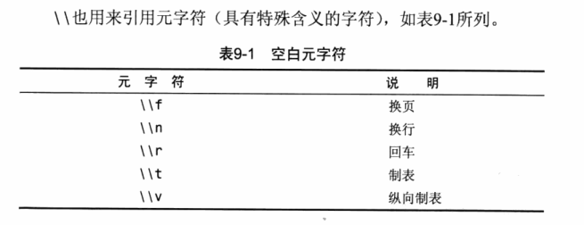
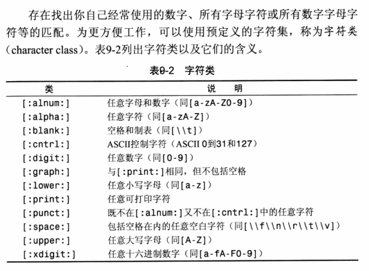
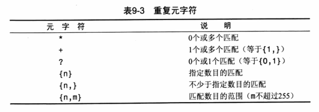
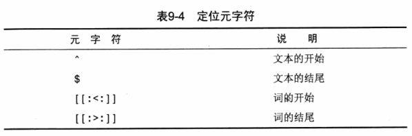

## mysql命令

### SELECT

- 选择一个列	

  ```mysql
  SELECT columnName FROM tableName;
  ```

- 选择多个列    

  ```mysql
  SELECT columnName1, columnName2 FROM tableName;
  ```

- 加 DISTINCT 在 SELECT 后面，可以使行的值只出现一遍

  ```mysql
  SELECT DISTINCT columnName1, columnName2 FROM tableName;
  ```

- 可以加 LIMIT 子句限制输出多少行

  ```mysql
  SELECT columnName FROM tableName LIMIT 5;
  ```

  ```mysql
  #从第五行开始输出，输出五行；行数从0算起。
  SELECT columnName FROM tableName LIMIT 5, 5;
  ```

- SELECT的排序

```mysql
#可以任意选择列和需要排序的列，默认是升序(ASC)
SELECT columnName1, columnName2, columnName3 
FROM tableName 
ORDER BY columnName2, columnName3;  

#降序需要加上DESC关键字
SELECT columnName1, columnName2, columnName3 
FROM tableName 
ORDER BY columnName2 DESC, columnName3;
```

### WHERE

- 根据特定条件筛选

```mysql
#同时使用 ORDER BY 和 WHERE 子句时，应该让 ORDER BY 在 WHERE 后面
SELECT columnName1, columnName2 
FROM tableName
WHERE columnName1 <= 1;

#使用BETWEEN
SELECT columnName1, columnName2 
FROM tableName
WHERE columnName1 BETWEEN 5 AND 10;

#除了AND以外，还有许多操作符如OR、IN、NOT
```

### LIKE

WHERE columnName LIKE + 通配符

**%：**任何字符出现任意次数

**_  ：**匹配单个字符

### 正则表达式

```mysql
#REGEXP关键字，正则表达式，加上某些通配符形成一个表达式，搜索特定的内容
#REGEXP后面接BINARY可区分大小写
SELECT  columnName1
FROM tableName
WHERE columnName1 REGEXP '[^123] ton'
```

.  ：匹配任意一个字符

| ：搜索两个串之一

[] ：如[123]表示匹配1或2或3

^  ：取非

[ - ]     ：[0-9]可表示0~9

\\\\ ：双斜杠可以用来查找特殊字符，转义







