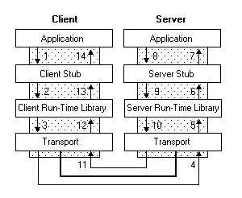

## RPC

远程过程调用

### RPC解决的问题

1. 决分布式系统中，服务之间的调用问题。
2. 远程调用时，要能够像本地调用一样方便，让调用者感知不到远程调用的逻辑。

### 如何实现RPC



1. 其中左边的Client，其实就是一个Service A，而右边的Server，对应的则是Service B。Service A的应用层代码中，希望调用Calculator的一个实现类的add方法，希望执行一个加法运算；这个Calculator实现类，内部并不是直接实现计算器的加减乘除逻辑，而是通过远程调用Service B的RPC接口，来获取运算结果，因此称之为Stub；
2. Stub怎么和Service B建立远程通讯呢？这时候就要用到远程通讯工具了，也就是图中的Run-time Library，这个工具将帮你实现远程通讯的功能，比如Java的Socket，就是这样一个库，当然，你也可以用基于Http协议的HttpClient，或者其他通讯工具类，都可以，RPC并没有规定说你要用何种协议进行通讯；
3. Stub通过调用通讯工具提供的方法，和Service B建立起了通讯，然后将请求数据发给Service B。需要注意的是，由于底层的网络通讯是基于二进制格式的，因此这里Stub传给通讯工具类的数据也必须是二进制，比如calculator.add(1,2)，你必须把参数值1和2放到一个Request对象里头（这个Request对象当然不只这些信息，还包括要调用哪个服务的哪个RPC接口等其他信息），然后序列化为二进制，再传给通讯工具类，这一点也将在下面的代码实现中体现；
4. 二进制的数据传到Service B这一边了，Service B当然也有自己的通讯工具，通过这个通讯工具接收二进制的请求；
5. 既然数据是二进制的，那么自然要进行反序列化了，将二进制的数据反序列化为请求对象，然后将这个请求对象交给Service B的Stub处理；
6. 和之前的Service A的Stub一样，这里的Stub也同样是个“假玩意”，它所负责的，只是去解析请求对象，知道调用方要调的是哪个RPC接口，传进来的参数又是什么，然后再把这些参数传给对应的RPC接口，也就是Calculator的实际实现类去执行。很明显，如果是Java，那这里肯定用到了反射。
7. RPC接口执行完毕，返回执行结果，现在轮到Service B要把数据发给Service A了，怎么发？一样的道理，一样的流程，只是现在Service B变成了Client，Service A变成了Server而已：Service B反序列化执行结果->传输给Service A->Service A反序列化执行结果 -> 将结果返回给Application，完毕。

### 理解

​		无论是相对于设备终端还是业务层来说，都使用了RPC，即都是经过远程调用的，因为中间经过了接入层，接入层设计了框架并封装了调用逻辑，使使用者感知不到调用逻辑，变得像本地调用一样方便。

## libevent

### 简介

​		Libevent 是一个用C语言编写的、轻量级的开源高性能事件通知库，主要有以下几个亮点：事件驱动（event-driven），高性能;轻量级，专注于网络，不如 ACE 那么臃肿庞大；源代码相当精炼、易读；跨平台，支持 Windows、 Linux、 [BSD](https://baike.baidu.com/item/BSD%E7%B3%BB%E7%BB%9F/372861?fr=aladdin) 和 Mac Os；支持多种 I/O 多路复用技术， epoll、 poll、 dev/poll、 select 和 kqueue 等；支持 I/O，定时器和信号等事件；注册事件优先级。

###特点和优势

- 事件驱动，高性能；
- 轻量级，专注于网络； 
- 跨平台，支持 Windows、Linux、Mac Os等； 
- 支持多种 I/O多路复用技术， epoll、poll、dev/poll、select 和kqueue 等； 
- 支持 I/O，定时器和信号等事件；

### libevent的组成

- **事件管理：**包括各种IO（socket）、定时器、信号等事件，也是libevent应用最广的模块；
- **缓存管理：**是指evbuffer功能；
- **DNS：**是libevent提供的一个异步DNS查询功能；
- **HTTP：**是libevent的一个轻量级http实现，包括服务器和客户端

### 理解

- 自己写的一个服务器是直接接触到epoll的调用，直接自己设计任务队列和相关的回调函数来处理任务，接触的东西比libevent更加底层一点点
- libevent是将各个平台的IO复用封装起来，封装成统一的时间通知函数，以实现跨平台的事件管理

### libevent的框架使用

#### API及调用顺序

- event_base()初始化event_base
- event_set()初始化event
- event_base_set()将event绑定到指定的event_base上
- event_add()将event添加到事件链表上，注册事件
- event_base_dispatch()循环、检测、分发事件

#### event_base

使用 libevent 函数之前需要分配一个或者多个 event_base 结构体。每个event_base
结构体持有一个事件集合,可以检测以确定哪个事件是激活的。

```C++
//创建event_base
//原型
struct event_base* event_base_new(void)
//示例
struct event_base* base = event_base_new();
//释放event_base
event_base_free(struct event_base* base);
```

#### event_new

```c++
// 创建新事件,等同于event_set()
	struct event *event_new(
		struct event_base *base, 
		evutil_socket_t fd, //文件描述符(int),底层是对epollin与epollout的封装
		short what, 
		event_callback_fn cb, // 事件的处理回调函数
		void *arg //回调函数传参
); 
// 事件的处理回调函数
	typedef void (*event_callback_fn)(evutil_socket_t, short, void *); 
//	short what
	#define  EV_TIMEOUT         0x01    // 已淘汰（忽略）
	#define  EV_READ            0x02
	#define  EV_WRITE           0x04
	#define  EV_SIGNAL          0x08    //libevent封装了信号相关的操作 SIGNAL
	#define  EV_PERSIST         0x10    // 持续触发
	#define  EV_ET              0x20    // 边沿模式

//释放事件
void event_free(struct event *event); 
```

#### event_add（）

​		创建事件之后,在将其添加到 event_base 之前实际上是不能对其做任何操作的。使用event_add()将事件添加到event_base。

```c++
// event_add,等同于event_base_set
	int event_add(
				struct event *ev, 
				const struct timeval *tv
				); 
```

| tv参数     | Value                                                        |
| :--------- | ------------------------------------------------------------ |
| NULL       | 事件被触发, 对应的回调被调用                                 |
| tv = {0,n} | 设置的时间，在该时间段内检测的事件没被触发, 时间到达之后, 回调函数还是会被调用 |

#### event_base_dispatch（）

最后，我们只需将添加事件循环
使用event_base_dispatch（）函数

```C++
/*event_base_dispatch（简化版event_base_loop（））*/
	int event_base_dispatch(struct event_base* base);
	//等同于没有设置标志的 event_base_loop ( )
	//将一直运行,直到没有已经注册的事件了,或者调用 了event_base_loopbreak()或者 event_base_loopexit()
```

```c++
/*event_base_loop（）*/
	int event_base_loop(struct event_base *base, int flags);
//正常退出返回0, 失败返回-1

//flages
#define EVLOOP_ONCE                        0x01
		//事件只会被触发一次
		//事件没有被触发, 阻塞等
#define EVLOOP_NONBLOCK                    0x02
		//非阻塞 等方式去做事件检测
		//不关心事件是否被触发了
#define EVLOOP_NO_EXIT_ON_EMPTY  		   0x04
		//没有事件的时候, 也不退出轮询检测
```

执行当前后退出 event_base_loopexit（）

```c++
//如果 event_base 当前正在执行激活事件的回调 ,它将在执行完当前正在处理的事件后立即退出
	 int event_base_loopexit(
				struct event_base *base,
				const struct timeval *tv
				);
//参数struct timeval *tv
			struct timeval {
			       long   tv_sec;                    
				   long   tv_usec;            
			};
```

立即退出循环 event_base_loopbreak（）

```C++
//让event_base 立即退出循环
		 int event_base_loopbreak(struct event_base *base);
		 
//返回值: 成功 0, 失败 -1
```

#### evthread_use_pthreads()

保证线程安全

## signal

### 基本使用

原型：

```C++
void (* signal (int sig，void (* func)  (int) ) ) (int);
```

**设置处理信号的功能**

指定使用sig指定的*信号编号*处理信号的方法。 参数func指定程序可以处理信号的三种方式之一：

- 默认处理（SIG_DFL）：信号由该特定信号的默认动作处理。
- 忽略信号（SIG_IGN）：忽略信号，即使没有意义，代码执行仍将继续。
- 函数处理程序：定义一个特定的函数来处理信号。

返回值：与参数func的类型相同

**SIG：设置处理功能的信号值**

| Signal     | Description                                                  |
| ---------- | ------------------------------------------------------------ |
| SIGABRT    | 由调用abort函数产生，进程非正常退出                          |
| SIGALRM    | 用alarm函数设置的timer超时或setitimer函数设置的interval timer超时 |
| SIGBUS     | 某种特定的硬件异常，通常由内存访问引起                       |
| SIGCANCEL  | 由Solaris Thread Library内部使用，通常不会使用               |
| SIGCHLD    | 进程Terminate或Stop的时候，SIGCHLD会发送给它的父进程。缺省情况下该Signal会被忽略 |
| SIGCONT    | 当被stop的进程恢复运行的时候，自动发送                       |
| SIGEMT     | 和实现相关的硬件异常                                         |
| SIGFPE     | 数学相关的异常，如被0除，浮点溢出，等等                      |
| SIGFREEZE  | Solaris专用，Hiberate或者Suspended时候发送                   |
| SIGHUP     | 发送给具有Terminal的Controlling Process，当terminal 被disconnect时候发送 |
| SIGILL     | 非法指令异常                                                 |
| SIGINFO    | BSD signal。由Status Key产生，通常是CTRL+T。发送给所有Foreground Group的进程 |
| SIGINT     | 由Interrupt Key产生，通常是CTRL+C或者DELETE。发送给所有ForeGround Group的进程 |
| SIGIO      | 异步IO事件                                                   |
| SIGIOT     | 实现相关的硬件异常，一般对应SIGABRT                          |
| SIGKILL    | 无法处理和忽略。中止某个进程                                 |
| SIGLWP     | 由Solaris Thread Libray内部使用                              |
| SIGPIPE    | 在reader中止之后写Pipe的时候发送                             |
| SIGPOLL    | 当某个事件发送给Pollable Device的时候发送                    |
| SIGPROF    | Setitimer指定的Profiling Interval Timer所产生                |
| SIGPWR     | 和系统相关。和UPS相关。                                      |
| SIGQUIT    | 输入Quit Key的时候（CTRL+\）发送给所有Foreground Group的进程 |
| SIGSEGV    | 非法内存访问                                                 |
| SIGSTKFLT  | Linux专用，数学协处理器的栈异常                              |
| SIGSTOP    | 中止进程。无法处理和忽略。                                   |
| SIGSYS     | 非法系统调用                                                 |
| SIGTERM    | 请求中止进程，kill命令缺省发送                               |
| SIGTHAW    | Solaris专用，从Suspend恢复时候发送                           |
| SIGTRAP    | 实现相关的硬件异常。一般是调试异常                           |
| SIGTSTP    | Suspend Key，一般是Ctrl+Z。发送给所有Foreground Group的进程  |
| SIGTTIN    | 当Background Group的进程尝试读取Terminal的时候发送           |
| SIGTTOU    | 当Background Group的进程尝试写Terminal的时候发送             |
| SIGURG     | 当out-of-band data接收的时候可能发送                         |
| SIGUSR1    | 用户自定义signal 1                                           |
| SIGUSR2    | 用户自定义signal 2                                           |
| SIGVTALRM  | setitimer函数设置的Virtual Interval Timer超时的时候          |
| SIGWAITING | Solaris Thread Library内部实现专用                           |
| SIGWINCH   | 当Terminal的窗口大小改变的时候，发送给Foreground Group的所有进程 |
| SIGXCPU    | 当CPU时间限制超时的时候                                      |
| SIGXFSZ    | 进程超过文件大小限制                                         |
| SIGXRES    | Solaris专用，进程超过资源限制的时候发                        |

### 其他细节

#### 关于SIGRTMIN和SIGRTMAX

​		Linux信号机制基本上是从Unix系统中继承过来的。早期Unix系统中的信号机制比较简单和原始，后来在实践中暴露出一些问题，因此，把那些建立在早期机制上的信号叫做"不可靠信号"，信号值小于SIGRTMIN(Red hat7.2中，SIGRTMIN=32，SIGRTMAX=63)的信号都是不可靠信号。这就是"不可靠信号"的来源。

​		信号值位于SIGRTMIN和SIGRTMAX之间的信号都是可靠信号，可靠信号克服了信号可能丢失的问题。

#### 关于SIGUSR1和SIGUSR2

​		 用户自定义的信号跟其他信号一样，可以输入某种特定组合产生，SIGUSR1是kill -USR1 pid，SIGUSR2类似，输入命令后会产生信号，进而处理相关的函数。进入到相关函数时，该函数的参数即是信号的数值，可以通过该参数判断触发了什么信号。

## pthread

### pthread_join

##### 原型：

```c++
int pthread_join(pthread_t thread, void **retval);
```

##### args:

  **pthread_t thread:** 被连接线程的线程号

  **void \**retval  :** 指向一个指向被连接线程的返回码的指针的指针

  **return:** 线程连接的状态，0是成功，非0是失败

​		当调用 pthread_join() 时，当前线程会处于阻塞状态，直到被调用的线程结束后，当前线程才会重新开始执行。当 pthread_join() 函数返回后，被调用线程才算真正意义上的结束，它的内存空间也会被释放（如果被调用线程是非分离的）。这里有三点需要注意：

- 被释放的内存空间仅仅是系统空间，你必须手动清除程序分配的空间，比如 malloc() 分配的空间。
- 一个线程只能被一个线程所连接。
- 被连接的线程必须是非分离的，否则连接会出错。

##### pthread_join()两种作用：

- **用于等待其他线程结束：**当调用 pthread_join() 时，当前线程会处于阻塞状态，直到被调用的线程结束后，当前线程才会重新开始执行。
- **对线程的资源进行回收：**如果一个线程是非分离的（默认情况下创建的线程都是非分离）并且没有对该线程使用 pthread_join() 的话，该线程结束后并不会释放其内存空间，这会导致该线程变成了“僵尸线程”。

### pthread_create

##### 原型

```C++
int pthread_create(
         pthread_t *restrict tidp,   //新创建的线程ID指向的内存单元。
         const pthread_attr_t *restrict attr,  //线程属性，默认为NULL
         void *(*start_rtn)(void *), //新创建的线程从start_rtn函数的地址开始运行
         void *restrict arg //默认为NULL。若上述函数需要参数，将参数放入结构中并将地址作为arg传入。
         );
```

##### 传递参数注意的问题

问题： 
避免直接在传递的参数中传递发生改变的量，否则会导致结果不可测。 
即使是只再创造一个单线程，也可能在线程未获取传递参数时，线程获取的变量值已经被主线程进行了修改。

通常解决方案： 
重新申请一块内存，存入需要传递的参数，再将这个地址作为arg传入。

##### 使用时注意防止内存泄漏

​		在默认情况下通过pthread_create函数创建的线程是非分离属性的，由pthread_create函数的第二个参数决定，在非分离的情况下，当一个线程结束的时候，它所占用的系统资源并没有完全真正的释放，也没有真正终止。

​		只有在pthread_join函数返回时，该线程才会释放自己的资源。 或者是设置在分离属性的情况下，一个线程结束会立即释放它所占用的资源。


