## C++

### C++编译与内存

#### 程序的编译过程

1. 预处理阶段，主要处理宏定义以及导入引入的文件
2. 编译阶段，将预处理阶段得到的⽂本⽂件翻译为汇编文件
3. 汇编，将汇编⽂件翻译成机器语言⽂件
4. 链接，导⼊引入的动态库和静态库

**gcc的编译参数**

```
-l链接库，-L库路径，-S得到汇编⽂件，-E得到预处理⽂件。
```

#### 静态库和动态库

- **静态库**     

​        之所以称为静态库，是因为在链接阶段，会将汇编生成的目标⽂件.o与引用到的库⼀起链接打包到可执行⽂件当中。因此对应的链接方式称为静态链接。

- **静态库的特点总结为：**

1. 静态库对函数库的链接是放在编译时期完成的
2. 程序在运行时与函数库再无瓜葛，移植方便
3. 浪费空间和资源，因为所有相关的目标文件与牵涉到的函数库被链接合成⼀个可执行文件。
    动态库
    **为什么需要动态库，其实也是静态库的特点导致：**
4. 空间浪费
5. 静态库对程序的更新、部署和发布会带来麻烦，更新⼀次需要全部重新编译。

- **动态库**

​        动态库在程序编译时不会被连接到目标代码中，而是在程序运行时才被载入。不同的应用程序如果调用相同的库，那么在内存中只需要有⼀份该共享库的实例，规避了空间浪费的问题。动态库在程序运行时才被载入，也解决了静态库对程序的更新带来的麻烦。

- **动态库特点总结：**
    - 动态库把⼀些库函数的链接载入推迟到程序运行的时期
    - 可以实现进程之间的资源共享
    - 将⼀些程序的升级变得简单
    - 甚⾄可以真正做到链接载⼊完全由程序员在程序代码中控制

#### 程序的内存区域

⼀个由C/C++编译的程序占用的内存分为以下几个部分：

1. 栈区——由编译器自动分配释放，存放函数的参数值，局部变量的值等。其操作⽅式类似于数据结构中的 栈。
2. 堆区——⼀般由程序员分配释放，若程序员不释放，程序结束时可能由OS回收。其分配方式类似于链表。
3. 全局区（数据段）——全局变量和静态变量的存储是需要放在⼀块的，初始化的全局变量和静态变量在一块区域，未初始化的全局变量和静态变量在相邻的另⼀块区域，程序结束后由系统释放。 
4. BSS段——存放未初始化的全局变量或静态变量
5. 文字（只读）常量区——常量字符串就是放在这里的。 
6. 程序代码区——存放函数体的⼆进制代码

```c++
//main.cpp 
int a = 0; //全局初始化区 
char *p1; //全局未初始化区 
main() 
{ 
int b; //栈 
char s[] = "abc"; //栈 
char *p2; //栈 
char *p3 = "123456"; // 123456\0 在常量区，p3在栈上。 
static int c =0； //全局（静态）初始化区 
p1 = (char *)malloc(10); 
p2 = (char *)malloc(20); 
//分配得来得10和20字节的区域就在堆区。 
strcpy(p1, "123456"); // 123456\0 放在常量区，编译器可能会将它与p3所指向的"123456"优化成⼀个地⽅。 
} 
```

- **申请方式**
    - 栈区：由系统自动分配。系统自动为变量开辟空间。
    - 堆区：需要程序员自己申请，并指明大小，在C中使用malloc函数，在C++中可以使用new运算符。
- **申请后系统的响应**
    - 栈区：只要栈的剩余空间大于所申请的空间，系统将为程序提供内存，否则将报异常提示栈溢出。
    - 堆区：内存分配的⼀系列操作
- **申请效率**
    - 栈区：由系统分配，速度较快。但程序员无法控制
    - 堆区：由new分配的内存，⼀般速度比较慢，而且容易产生内存碎片，但用起来最方便。
- **存储内容**
    - 栈：在函数调用时，第⼀个进栈的是函数调用语句的下⼀条可执行语句的地址，然后是函数的各个参数，在大多数的C编译器中，参数是从右往左入栈的，然后是函数中的局部变量。注意静态变量是存放在静态区的。当本次函数调用结束后，局部变量先出栈，然后是参数，最后是主函数中的下⼀条指令。
    - 堆：⼀般是在堆的头部用⼀个字节存放堆的大小。
- **存取效率的比较**

```c++
char s1[] = "aaaaaaaaaaaaaaa";
char *s2 = "bbbbbbbbbbbbbbbbb";
//aaaaaaaaaaa是在运⾏时刻赋值的；
//⽽bbbbbbbbbbb是在编译时就确定的；
//但是，在以后的存取中，在栈上的数组⽐指针所指向的字符串(例如堆)快。 因为s2⾸先要访问存放在栈上的指针本⾝，然后通过s2来访问常量区
```

#### C++的内存对齐

**C++内存对齐作用：**

- 内存是以字节为单位存储的，但是处理器并不会按照⼀个字节为单位去存取内存。处理器存取内存是以块为单位，块的大小可以是2,4,8,16字节大小，这样的存取单位称为**内存存取粒度**。如果在64位的机器上，不论CPU是要读取第0个字节还是要读取第1个字节，在硬件上传输的信号都是⼀样的。因为它都会把地址0到地址7，这8个字节全部读到CPU，只是当我们需要读取第0个字节时，丢掉后面7个字节，当我们是需要读取第1个字节，丢掉第1个和后面6个字节。所以对于计算机硬件来说，内存只能通过特定的对齐地址进行访问。
- 从内存存取效率考虑，内存对齐的情况下可以提升CPU存取内存的效率。比如有⼀个整型变量，现在有⼀块内存单元：地址从0到7。这个整型变量从地址为1的位置开始占据了1,2,3,4这4个字节。现在处理器需要读取这个整型变量。假设处理器是4字节4字节的读取，所以从0开始读取0,1,2,3发现并没有读完整这个变量，那么需要再读⼀次，读取4,5,6,7.然后对两次读取的结果进行处理，提取出1,2,3,4地址的内容。需要两次访问内存，同时通过⼀些逻辑计算才能得到最终的结果。如果进行内存对齐，将这个整型变量放在从0开始的地址存放，那么CPU只需要⼀次内存读取，并且没有额外的逻辑计算。

​        **对齐作用简单来说两点：一是对硬件来说，内存只能通过特定的对齐地址进行访问，有些机器甚至不允许读不对齐的内存。二是内存对齐的情况下可以大大提升CPU的存取效率。**

**C++内存对齐原则：**

- 数据成员对齐规则：结构(struct)(或联合(union))的数据成员，第一个数据成员放在offset为0的地方，**以后每个数据成员存储的起始位置要从该成员大小或者该成员的子成员大小**（只要该成员有子成员，比如说是数组，结构体等）**的整数倍开始**(比如int在３２位机为４字节, 则要从４的整数倍地址开始存储)，基本类型不包括struct/class/uinon。
- 结构体作为成员:**如果一个结构里有某些结构体成员,则结构体成员要从其内部"最宽基本类型成员"的整数倍地址开始存储**.(struct a里存有struct b,b里有char,int ,double等元素,那b应该从8的整数倍开始存储.)。
- 收尾工作:**结构体的总大小,也就是sizeof的结果，必须是其内部最大成员的“最宽基本类型成员”的整数倍，不足的要补齐。**(基本类型不包括struct/class/uinon)。
- sizeof(union)，以结构里面size最大元素为union的size，因为在某一时刻，union只有一个成员真正存储于该地址。

#### C++空类内存分配

- 在一个空的类中会产生成员构造函数、复制构造函数、析构函数、赋值函数、取址运算符&、括号运算符()
- 我们声明某个类型的实例的时候，它必须在内存中占有一定的空间，一般是一个字节，否则无法使用这些实例
- 在没有虚函数的时候，C++类的大小只与其数据成员有关, 它有没有声明函数或者在类中实现函数都不影响类的大小。函数存放在代码段里面。
- 有虚函数的时候，因为该类型的每个实例会生成一个指向虚函数的指针，32位机器该指针占4字节，64位机器该指针占8字节

#### C++内存资源管理

​		**RAII技巧管理内存资源，**RAII也称为“资源获取就是初始化”，是c++等编程语言常用的管理资源、避免内存泄露的方法。它保证在任何情况下，使用对象时先构造对象，最后析构对象。

**理解**

RAII 的做法是使用一个对象，在其构造时获取资源，在对象生命期控制对资源的访问使之始终保持有效，最后在对象析构的时候释放资源。

**使用**

每当处理需要配对的获取/释放函数调用的资源时，都应该将资源封装在一个对象中，实现自动资源释放。

**总结**

​		RAII的核心思想 是 使用对象管理资源 ， 对象“消亡”则自动释放资源。理解和使用RAII能使软件设计更清晰，代码更健壮。与大名鼎鼎的垃圾收集(GC)不同的是，RAII可管理广义的资源，而垃圾收集只关注“内存泄漏”，不关心诸如文件句柄、同步对象等一些系统资源的泄漏问题。RAII能使程序员确定资源释放的时机，这也正是C++/CLI引入确定性资源清理的原因。

​		RAII的本质内容是用对象代表资源，把管理资源的任务转化为管理对象的任务，将资源的获取和释放与对象的构造和析构对应起来，从而确保在对象的生存期内资源始终有效，对象销毁时资源必被释放。换句话说，拥有对象就等于拥有资源，对象存在则资源必定存在。

### C++ 11新特性

#### for 循环

C++11 引入了基于范围的迭代写法，我们拥有了能够写出像 Python 一样简洁的循环语句

```c++
//遍历数组or字符串
std::string str = “hello, world”;  
int arr[] = {1, 2, 3, 4}; 
for(auto i : arr) {    
    std::cout << i << std::endl;
}

//遍历容器，用引用可以改变容器值
std::vector<std::string> str_vec = {“i”, “like”,  "google”};  
for(auto& it : str_vec) {  
    it = “c++”;  
} 
                                    
//遍历stl map 
std::map<int, string> hash_map = {{1, “c++”}, {2, “java”}, {3, “python”}};  
for(auto it : hash_map) {  
     std::cout << it.first << “\t” << it.second << std::endl;  
}  
```

#### 初始化列表

- C++11 提供了统一的语法来初始化任意的对象

```c++
struct A {
    int a;
    float b;
};

A a {1, 1.1};    // 统一的初始化语法
```

- C++11 还把初始化列表的概念绑定到了类型上，并将其称之为 std::initializer_list，允许构造函数或其他函数像参数一样使用初始化列表，这就为类对象的初始化与普通数组和 POD 的初始化方法提供了统一的桥梁

```c++
#include <initializer_list>

class Magic {
public:
    Magic(std::initializer_list<int> list) {}
};

Magic magic = {1,2,3,4,5};
std::vector<int> v = {1, 2, 3, 4};
```

#### 模板增强

- C++11 引入了外部模板，扩充了原来的强制编译器在特定位置实例化模板的语法，使得**能够显式的告诉编译器何时进行模板的实例化**：

```c++
template class std::vector<bool>;            // 强行实例化
extern template class std::vector<double>;  // 不在该编译文件中实例化模板
```

- 在传统 C++中，typedef 可以为类型定义一个新的名称，但是却没有办法为模板定义一个新的名称。因为，模板不是类型。C++11 使用 using 引入了下面这种形式的写法，并且同时支持对传统 typedef 相同的功效：

```c++
template <typename T>
using NewType = SuckType<int, T, 1>;    // 合法
```

- 模板可以指定默认参数    //疑惑：指定默认参数还用模板干啥

#### 构造函数

- C++11 引入了委托构造的概念，这使得构造函数可以在同一个类中一个构造函数调用另一个构造函数，从而达到简化代码的目的
- 继承构造：

```C++
struct A{
  A(int i) {}
  A(double d,int i){}
  A(float f,int i,const char* c){}
  //...等等系列的构造函数版本
}；
struct B:A{
  using A::A;
  //关于基类各构造函数的继承一句话搞定
  //......
}；
```

#### Lambda 表达式

Lambda 表达式，实际上就是提供了一个类似匿名函数的特性，而匿名函数则是在需要一个函数，但是又不想费力去命名一个函数的情况下去使用的。

Lambda 表达式的基本语法如下：

```C++
[ caputrue ] ( params ) opt -> ret { body; };
```

1. capture是捕获列表；[&], [=], [=, &foo], [bar], [this]

2. params是参数表；(选填)

3. opt是函数选项；可以填mutable,exception,attribute（选填）

   mutable说明lambda表达式体内的代码可以修改被捕获的变量，并且可以访问被捕获的对象的non-const方法。

   exception说明lambda表达式是否抛出异常以及何种异常

   attribute用来声明属性。

4. ret是返回值类型（拖尾返回类型）(选填)

5.  body是函数体。

#### 新增容器

- **std::array**

    ​		std::array 保存在栈内存中，相比堆内存中的 std::vector，我们能够灵活的访问这里面的元素，从而获得更高的性能。

- **std::forward_list**

    ​		std::forward_list 是一个列表容器，使用方法和 std::list 基本类似。和 std::list 的双向链表的实现不同，std::forward_list 使用单向链表进行实现，提供了 O(1) 复杂度的元素插入，不支持快速随机访问（这也是链表的特点），也是标准库容器中唯一一个不提供 size() 方法的容器。当不需要双向迭代时，具有比 std::list 更高的空间利用率。

- **元组 std::tuple**

std::make_tuple: 构造元组
std::get: 获得元组某个位置的值
std::tie: 元组拆包

#### 正则表达式

   	正则表达式描述了一种字符串匹配的模式。一般使用正则表达式主要是实现下面三个需求

1. 检查一个串是否包含某种形式的子串；
2. 将匹配的子串替换；
3. 从某个串中取出符合条件的子串。

​		 **[a-z]+.txt:** 在这个正则表达式中, [a-z] 表示匹配一个小写字母, + 可以使前面的表达式匹配多次，因此 [a-z]+ 能够匹配一个及以上小写字母组成的字符串。在正则表达式中一个 . 表示匹配任意字符，而 . 转义后则表示匹配字符 . ，最后的 txt 表示严格匹配 txt 这三个字母。因此这个正则表达式的所要匹配的内容就是文件名为纯小写字母的文本文件。
​		 std::regex_match 用于匹配字符串和正则表达式，有很多不同的重载形式。最简单的一个形式就是传入std::string 以及一个 std::regex 进行匹配，当匹配成功时，会返回 true，否则返回 false。例如:

```c++
#include <iostream>
#include <string>
#include <regex>

int main() {
    std::string fnames[] = {"foo.txt", "bar.txt", "test", "a0.txt", "AAA.txt"};
    // 在 C++ 中 `\` 会被作为字符串内的转义符，为使 `\.` 作为正则表达式传递进去生效，需要对 `\` 进行二次转义，从而有 `\\.`
    std::regex txt_regex("[a-z]+\\.txt");
    for (const auto &fname: fnames)
        std::cout << fname << ": " << std::regex_match(fname, txt_regex) << std::endl;
}
```

   	 另一种常用的形式就是依次传入 std::string/std::smatch/std::regex 三个参数，其中 std::smatch 的本质其实是 std::match_results，在标准库中， std::smatch 被定义为了 std::match_results，也就是一个子串迭代器类型的 match_results。使用 std::smatch 可以方便的对匹配的结果进行获取，例如：

```c++
std::regex base_regex("([a-z]+)\\.txt");
std::smatch base_match;
for(const auto &fname: fnames) {
    if (std::regex_match(fname, base_match, base_regex)) {
        // sub_match 的第一个元素匹配整个字符串
        // sub_match 的第二个元素匹配了第一个括号表达式
        if (base_match.size() == 2) {
            std::string base = base_match[1].str();
            std::cout << "sub-match[0]: " << base_match[0].str() << std::endl;
            std::cout << fname << " sub-match[1]: " << base << std::endl;
        }
    }
}
```

详细总结：<https://blog.csdn.net/zhanglu_1024/article/details/85049480>

#### [互斥量和锁](https://www.cnblogs.com/haippy/p/3237213.html)

- 互斥量std::mutex

```c++
//#include <mutex>
std::mutex mtx;
mtx.lock()
/*操作*/
mtx.unlock()
```

- 锁std::lock_guard 

```c++
//#include <mutex>
{
    std::lock_guard<std::mutex> lock (mtx);
    /*操作*/
}
//上锁的作用域在括号的范围内
```

#### 线程支持

```c++
//#include <thread>
std::thread myThread(func, arg);
myThread.join();
//该操作在主线程执行
```

> 可被 joinable 的 thread 对象必须在他们销毁之前被主线程 join 或者将其设置为 detached.
>
> 线程添加后开始执行函数func，函数的参数为arg

#### auto

C11标准，auto的作用是自动类型转换，作用有

- 用于代替冗长复杂、变量使用范围专一的变量声明
- 在定义模板函数时，用于声明依赖模板参数的变量类型
- 用于模板函数依赖于模板参数的返回值
- auto 不能用于函数传参
- 必须在定义时初始化

#### nullptr 

用来区分NULL和0，更加灵活

#### decltype

decltype 关键字是为了解决 auto 关键字只能对变量进行类型推导的缺陷而出现的。

- 有时候，我们可能需要计算某个表达式的类型

```c++
  auto x = 1;
  auto y = 2;
  decltype(x+y) z;
```

  拖尾返回类型（trailing return type）

```c++
  template<typename T, typename U>
  auto add(T x, U y) -> decltype(x+y) {
      return x+y;
  }
```

  C14开始允许以下使用：

```C++
  template<typename T, typename U>
  auto add(T x, U y) {
      return x+y;
  }
```

#### std::function

​    	通过`std::function`对C++中各种可调用实体（普通函数、Lambda表达式、函数指针、以及其它函数对象等）的封装，形成一个新的可调用的`std::function`对象。

```c++
# include <iostream>
# include <functional>
using namespace std;

std::function<bool(int, int)> fun;
//普通函数
bool compare_com(int a, int b){
    return a > b;
}
//类成员函数
class compare
{
public:
    bool compare_member(int a, int b){
        return a > b;
    }
};
int main()
{
    bool result;
    fun = compare_com;
    result = fun(10, 1);
    cout << "普通函数输出, result is " << result << endl;
 
//类普通成员函数比较特殊，需要使用bind函数，并且需要实例化对象，成员函数要加取地址符
	compare temp;
	fun = std::bind(&compare::compare_member, temp, 	        std::placeholders::_1, std::placeholders::_2);
	result = fun(10, 1);
	cout << "类普通成员函数输出, result is " << result << endl;
}
```

	可见std::function的使用其实是很简单的，只要创建一个模板类对象，并传入相应的模板参数就可以存储任何具有相同返回值和参数的可调用对象，在调用的时候直接将std::function对象加上（）或加如参数就可以调用存储在其中的可调用实体。

- 关于可调用实体转换为std::function对象需要遵守以下两条原则：
  - 转换后的std::function对象的参数能转换为可调用实体的参数；
  - 可调用实体的返回值能转换为std::function对象的返回值。
- std::function对象最大的用处就是在实现函数回调，使用者需要注意，它不能被用来检查相等或者不相等，但是可以与NULL或者nullptr进行比较。
- 需要注意的是创建的std::function对象中存储的可调用实体不能为空，若对空的std::function进行调用将抛出 std::bad_function_异常。

#### placehold&std::bind 

**placehold**

```c++
namespace placeholders {
extern /* unspecified */ _1;
extern /* unspecified */ _2;
extern /* unspecified */ _3;
}
```

	其中_1, _2, _3是未指定的数字对象，用于function的bind中。 _1用于代替回调函数中的第一个参数， _2用于代替回调函数中的第二个参数，以此类推。

**bind**

 	std::bind函数定义在头文件functional中，是一个函数模板，它就像一个函数适配器，接受一个可调用对象（callable object），生成一个新的可调用对象来“适应”原对象的参数列表。

**原型：** `bind( F&& f, Args&&... args );`

> f：一个可调用对象（可以是函数对象、函数指针、函数引用、成员函数指针、数据成员指针），它的参数将被绑定到args上。 
>
> args：绑定参数列表，参数会被值或占位符替换，其长度必须与f接收的参数个数一致。

**作用：**a.延迟计算

#### std::shared_ptr

- 智能指针主要的用途就是方便资源的管理，**自动释放没有指针引用的资源**。

- 使用**引用计数**来标识是否有多余指针指向该资源。(注意，shart_ptr本身指针会占1个引用)

- 在**赋值操作**中, 原来资源的引用计数会减一，新指向的资源引用计数会加一。

- **引用计数加一/减一操作是原子性的**，所以线程安全的。

- make_shared要优于使用new，**make_shared可以一次将需要内存分配好**。

```c++
std::shared_ptr<Test> p = std::make_shared<Test>();
std::shared_ptr<Test> p(new Test);
```

- std::shared_ptr的大小**是原始指针的两倍**，因为它的内部有一个原始指针指向资源，同时有个指针指向引用计数。

- **引用计数是分配在动态分配的**，std::shared_ptr支持拷贝，新的指针获可以获取前引用计数个数。
- 注意避免循环引用，shared_ptr的一个最大的陷阱是循环引用，循环，循环引用会导致堆内存无法正确释放，导致内存泄漏。

例子详解：<https://www.cnblogs.com/wxquare/p/4759020.html>

#### make_shared

**优点1：提高性能**

​        std::make_shared（比起直接使用new）的一个特性是能提升效率。使用std::make_shared允许编译器产生更小，更快的代码，产生的代码使用更简洁的数据结构。考虑下面直接使用new的代码：

```c++
std::shared_ptr<Widget> spw(new Widget);
```

​        很明显这段代码需要分配内存，但是它实际上要分配两次。每个std::shared_ptr都指向一个控制块，控制块包含被指向对象的引用计数以及其他东西。这个控制块的内存是在std::shared_ptr的构造函数中分配的。因此直接使用new，需要一块内存分配给Widget，还要一块内存分配给控制块。

如果使用std::make_shared来替换

```c++
auto spw = std::make_shared<Widget>();
```

​        一次分配就足够了。这是因为std::make_shared申请一个单独的内存块来同时存放Widget对象和控制块。这个优化减少了程序的静态大小，因为代码只包含一次内存分配的调用，并且这会加快代码的执行速度，因为内存只分配了一次。另外，使用std::make_shared消除了一些控制块需要记录的信息，这样潜在地减少了程序的总内存占用。

​        对std::make_shared的效率分析可以同样地应用在std::allocate_shared上，所以std::make_shared的性能优点也可以扩展到这个函数上。

**优点2：异常安全**

**缺点1：构造函数是保护或私有时,无法使用 make_shared**

**缺点2：对象的内存可能无法及时回收**

#### unique_ptr

1. unique_ptr是一个独享所有权的智能指针，无法进行复制构造、赋值操作操作，只能进行移动操作。无法使两个unique_ptr指向同一个对象
2. unique_ptr智能指向一个对象，如果当它指向其他对象时，之前所指向的对象会被摧毁
3. unique_ptr对象会在它们自身被销毁时使用删除器自动删除它们管理的对象。
4. unique_ptr支持创建数组对象方法。
5. **reset函数：**reset函数的主要作用就是销毁当前由unique_ptr（如果有）管理的对象并取得p的所有权。
6. **release函数：**该函数负责释放当前管理对象的指针（即unique_ptr中class T的对象）
7. **get函数：**返回存储的指针。

### C++ STL容器

|   组件   | 描述                                                         |
| :------: | ------------------------------------------------------------ |
|   容器   | 容器是用来管理某一类对象的集合。C++ 提供了各种不同类型的容器，比如 deque、list、vector、map 等。 |
|   算法   | 算法作用于容器。它们提供了执行各种操作的方式，包括对容器内容执行初始化、排序、搜索和转换等操作。 |
|  迭代器  | 迭代器用于遍历对象集合的元素。这些集合可能是容器，也可能是容器的子集。 |
| 函数对象 | 函数对象是定义了operator()的类                               |
|  分配器  | 隐藏在STL容器后的内存管理工作是通过STL提供的一个默认的allocator实现的。 |

#### 容器

[STL容器特点和比较](https://blog.csdn.net/crusierLiu/article/details/82626090)

[STL容器底层](https://www.jianshu.com/p/834cc223bb57)

| **标准容器类** | **特点**                                       |
| -------------- | ---------------------------------------------- |
| 顺序性容器     |                                                |
| vector         | 从后面快速的插入与删除，直接访问任何元素       |
| deque          | 从前面或后面快速的插入与删除，直接访问任何元素 |
| list           | 双链表，从任何地方快速插入与删除               |
| 关联容器       |                                                |
| set            | 快速查找，不允许重复值                         |
| multiset       | 快速查找，允许重复值                           |
| map            | 一对多映射，基于关键字快速查找，不允许重复值   |
| multimap       | 一对多映射，基于关键字快速查找，允许重复值     |
| 容器适配器     |                                                |
| stack          | 后进先出                                       |
| queue          | 先进先出                                       |
| priority_queue | 最高优先级元素总是第一个出列                   |

##### vector

- vector<int> a(vec.begin(), vec.begin+3); //定义了a值为b中第0个到第2个（共3个）元素

    vector<int> a(str, str+7); //从数组中获得初值

- vec.size(); //返回a中元素的个数；

- vec.push_back(5); //在vec的最后一个向量后插入一个元素，其值为5

    vec.pop_back(); //删除vec向量的最后一个元素

- vec.front(); //返回vec的第一个元素的值

    vec.back(); //返回vec的最后一个元素的值

- vec.begin()；//返回指向vec第一个元素的指针

    vec.end(); //返回指向vec最后一个元素的后一个指针

- vec.insert(vec.begin()+1, 5); //在vec的第1个元素（从第0个算起）的位置插入数值5，如a为1,2,3,4，插入元素后为1,5,2,3,4

    vec.insert(vec.begin()+1, arr+3, arr+6); //arr为数组，在vec的第1个元素（从第0个算起）的位置插入arr的第3个元素到第5个元素（不包括b+6），如arr为1,2,3,4,5,9,8，插入元素后为1,4,5,9,2,3,4,5,9,8

- vec.erase(vec.begin()+1, vec.begin()+3); //删除vec中第1个（从第0个算起）到第2个元素，也就是说删除的元素从vec.begin()+1算起（包括它）一直到vec.begin()+3（不包括它）

- vec.assign(4,2); //使vec只含4个元素，且每个元素为2

    vec.assign(vec2.begin(),vec2.begin()+3); //vec2为向量，将vec2的0~2个元素构成的向量赋给vec

- vec[i]; //返回vec的第i个元素，当且仅当vec[i]存在

- vec.empty(); //判断vec是否为空，空则返回ture,不空则返回false

- vec.clear(); //清空vec中的元素

- vec.capacity(); //返回vec在内存中总共可以容纳的元素个数

- vec.resize(10); //将a的现有元素个数调至10个，多则删，少则补，其值随机

    vec.resize(10,2); //将a的现有元素个数调至10个，多则删，少则补，其值为2

    vec.reserve(100); //将vec的容量（capacity）扩充至100，也就是说现在测试vec.capacity();的时候返回值是100.这种操作只有在需要给a添加大量数据的时候才显得有意义，因为这将避免内存多次容量扩充操作（当vec的容量不足时电脑会自动扩容，当然这必然降低性能） 

- vec.swap(vec2); //vec2为向量，将vec中的元素和vec2中的元素进行整体性交换

- vec1==vec2; //向量的比较操作还有!=,>=,<=,>,<

##### list

​        List将元素按顺序储存在链表中. 与 向量(vectors)相比, 它允许快速的插入和删除，但是随机访问却比较慢。List是链表的加强版，vector是数组的加强版。

- 初始化，跟vector一样

- list.push_front(5)； //从链表头部插入一个元素

    list.push_back(5)； //从链表尾部插入一个元素

- list.insert(list.begin(),100); 在list的开始位置插入100。

    list.insert(list.begin(),list2.begin(),list2.end());在list的开始位置插入list2的从开始到结束的所有位置的元素。

- list.pop_front(); //弹出链表第一个元素，不能在链表为空时操作

    list.pop_back(); //弹出链表最后一个元素，不能在链表为空时操作

- list.erase(list.begin()); 将list的第一个元素删除。

    list.erase(list.begin(),list.end()); 将list的从begin()到end()之间的元素删除，同vector一样，不包括list.end()

- list.front(); //返回list的第一个元素的值

    list.back(); //返回list的最后一个元素的值

- list.begin()；//返回指向list第一个元素的指针

    list.end(); //返回指向list最后一个元素的后一个指针

- list.assign(4,2); //使list只含4个元素，且每个元素为2

    list.assign(list2.begin(),list2.begin()+3); //将list2的0~2个元素构成的向量赋给list，同样，前闭后开

##### stack

- 初始化，一般初始化为空
- empty()、size()用法与其他STL相同，不赘述
- stack.push(val);    //增：插入一个val值，注意与其他stl的push_back有区别
- stack.pop();    //删：弹出栈顶值，注意与其他stl的pop_back有区别
- stack.top();    //查：返回栈顶值
- stack1.swap(stack2)；   //更换两个栈的内容

##### queue

- 初始化，一般初始化为空
- empty()、size()用法与其他STL相同，不赘述
- queue.push(val);    //增：入队，队尾插入一个val值，注意与其他stl的push_back有区别
- queue.pop();    //删：出队，队头删除一个val值，注意与其他stl的pop_back有区别
- queue.back();    //查：返回队尾值，注意与栈的top()访问不同
- queue.front();   //查：返回队头值，注意与栈的top()访问不同
- stack1.swap(stack2)；   //更换两个队列的内容

##### deque

双端队列，可快速在前后插入或删除队列，其他使用方法与list和vector类似

##### priority_queue

优先队列，最高优先级元素总是第一个出列

定义：priority_queue<Type, Container, Functional>
Type 就是数据类型，Container 就是容器类型（Container必须是用数组实现的容器，比如vector,deque等等，但不能用 list。STL里面默认用的是vector），Functional 就是比较的方式，当需要用自定义的数据类型时才需要传入这三个参数，使用基本数据类型时，只需要传入数据类型，默认是大顶堆，用less

​    **注意：less依然是内置类型从小到大排序，不过这里是队列，然后所取的数也是top，即顶部元素，用栈来理解刚好是最后一个元素，因此以这个元素为起点的话是构建了一个大顶堆，并不是是less是用来构建大顶堆的，less只帮你从小到大排序，是否是大顶堆要看你以哪个为起点！**

​    **一般来说用push，pop的数据结构一般都是用less构造，然后构造成大顶堆，跟上面一样理解，不过less始终是将内置类型从小到大排序，悉知！**

```C++
priority_queue<int,vector<int>,less<int> > big_heap2;  //默认大顶堆
```

```c++
priority_queue<int,vector<int>,greater<int> > small_heap; 
```

##### set

​        set是STL的一个关联容器，可快速查值，它底层使用平衡的搜索树——红黑树实现，插入删除操作时仅仅需要指针操作节点即可完成，不涉及到内存移动和拷贝，所以效率比较高。multiset与set一样，不过可以允许重复值。

```c++
set<int, greater<int> > seta; //创建一个带大于比较器的set
set<int, less<int> > setb; //默认创建一个带小于比较器的set  
```

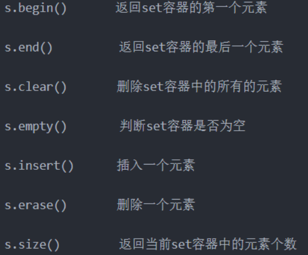

##### map

map是STL的一个关联容器，它提供一对一的hash。

第一个可以称为关键字(key)，每个关键字只能在map中出现一次；
第二个可以称为该关键字的值(value)；

```C++
//创建
map<int, char> mymap; 						// 定义了一个名为mymap的空的map
map<int, char> mymap2(m); 					// 创建了mymap的副本mymap2
map<int, char> mymap3(m.begin(), m.end()); 	// 创建了map对象mymap3，并且存储迭代器范围内的所有元素的副本

//使用下标插入
mymap['a'] = "an element";
mymap['b'] = "another element";
mymap['c'] = mymap['b'];

/*使用insert插入*/
	// （1）插入单个值
    mymap.insert(std::pair<char, int>('a', 100));
    mymap.insert(std::pair<char, int>('z', 200));
    mymap.insert(std::make_pair('f', 300));	// pair方式和make_pair功能是一样的

    // （2）指定位置插入
    std::map<char, int>::iterator iter = mymap.begin();
    mymap.insert(iter, std::pair<char, int>('b', 300));
    mymap.insert(iter, std::pair<char, int>('c', 400));

    // （3）范围多值插入
    std::map<char, int> anothermap;
    anothermap.insert(mymap.begin(), mymap.find('c'));

    // （4）列表形式插入
    anothermap.insert({ { 'd', 100 }, {'e', 200} });
```


#### 算法

​       STL算法部分主要由头文件 <algorithm>,<numeric>,<functional> 组成。要使用 STL中的算法函数必须包含头文件 <algorithm>，对于数值算法须包含 <numeric>，<functional> 中则定义了一些模板类，用来声明函数对象。

STL 中算法大致分为四类：

**非可变序列算法：**指不直接修改其所操作的容器内容的算法。
**可变序列算法：**指可以修改它们所操作的容器内容的算法。
**排序算法：**包括对序列进行排序和合并的算法、搜索算法以及有序序列上的集合操作。
**数值算法：**对容器内容进行数值计算。

常用算法总结：<https://www.cnblogs.com/linuxAndMcu/p/10264339.html>

​        算法作用于容器。它们提供了执行各种操作的方式，包括对容器内容执行初始化、排序、搜索和转换等操作。算法一般来说有两个参数，参数都是迭代器类型（验证迭代器是算法和容器的中介，算法一般对容器进行操作）。也可以加第三个参数，第三个参数一般是一个函数（或函数对象），以此进行算法的重载。

- **for_each()**

​        std::for_each()函数基于C++容器的迭代器，实现容器内元素的遍历，并对每个函数执行回调函数，**for_each()只能配合global function和function object**。

​        第一个参数是迭代器类型，开始的指针；第二个参数同样是迭代器类型，结束指针的下一个指针，第三个参数是回调函数，可以用lamda表达式，跟QT的槽函数有点类似。

```c++
//与全局函数配合使用，本质还是用Bind转换成函数对象
void fun(int i, const char* str){
	cout<<str<<i<<endl;
}
int main()
{
	int a[] = { 1, 2, 3, 4};
	vector<int> v(a, a + 4);//复制[begin,end)区间内另一个数组的元素到vector中
	for_each(v.begin(), v.end(), bind(&fun, "Element:"));
}
```

```c++
struct Play{
    const char* str;
    Play(const char* s):str(s) {}
    void operator () (int i){
        cout<<str<<i<<endl;
    }
};

int main()
{
    int a[] = { 1, 3, 4, 5};
    vector<int> v(a, a + 4);
    for_each(vc.begin(), vc.end(), Play("Element:"));
}
```

#### 迭代器

`容器类名<类型>::iterator  迭代器名`

​        迭代器（Iterators）是一个纯抽象的概念：任何东西，只要其行为类似迭代器，它就是一个迭代器.也就是说，只有具备有迭代器的四种基本操作：取值（*），递增（++），比较（== !=） 赋值（=）它就是迭代器。

​        迭代器是一种检查容器内元素并遍历元素的数据类型，要访问顺序容器和关联容器中的元素，需要通过“迭代器（iterator）”进行。迭代器也是容器和操纵容器的算法之间的中介。迭代器可以指向容器中的某个元素，通过迭代器就可以读写它指向的元素。从这一点上看，迭代器指针类似。

| 容器           | 迭代器功能   |
| -------------- | ------------ |
| vector         | 随机访问     |
| deque          | 随机访问     |
| list           | 双向         |
| set / multiset | 双向         |
| map / multimap | 双向         |
| stack          | 不支持迭代器 |
| queue          | 不支持迭代器 |
| priority_queue | 不支持迭代器 |

​        c++标准库中提供了数个预先定义的特需迭代器也就是所谓的迭代器配接器（Iterator Adapters）。下面主要介绍安插型迭代器（insert iterators）。

**1)back_inserter(container)：**

​         使用push_back()在容器尾端安插元素，元素排列顺序和安插顺序相同。只有在提供了push_back()成员函数的容器才能使back_inserter(container)这样的容器有：vector,deque,list

**2)front_inserter(container):**

​        在内部调用push_front()成员函数，将元素安插于容器中最前端。采用头插法插入元素，数据元素在容器中的位置和插入时的顺序刚好相反。同样，只有提供了push_front()成员函数的容器才能使用 front_inserter(container)这样的迭代器有：deque,list.

**3)inserter(container,pos):**

​         在内部调用insert()成员函数，将元素插入第二个参数所指的位置。因为在stl所有的容器中都包含有insert()成员函数，所以所有的容器包括关联式容器都能够使用 inserter(container, pos）.但是，我们知道关联式容器中数据元素是有序的，数据元素在容器中的位置只是和元素值有关。在关联式容器中，提供一个迭代器只是告诉容器确定从什么地方开始搜寻正确的位置，如果提示不正确的话，效率比没有提示更糟，所以对关联式容器来说，我们必须慎重。

#### 函数对象

- **函数对象的基本概念**
  - 函数对象本质上是一个类而不是一个函数
  - 函数对象重载了运算符()，从而使对象能够像函数一样的被调用
  - 函数对象是定义了operator()的类

- **函数对象与普通函数的对比**
  - 函数对象超出了普通函数的功能，能够保存函数调用状态（如果使用全局变量保存函数调用次数，要给程序加锁，解锁。所以不推荐使用全局变量；而函数对象则能够很好的解决该问题。）
  - 函数对象可以做（模板参数）参数，做返回值（利用for_each实现打印容器vector中的所有元素）
  - STL中预定义了很多函数对象供我们使用；STL中的函数对象都封装在functional头文件中
  - 一元函数对象，二元函数对象，一元谓词，二元谓词 函数对象接收一个参数，称为一元函数对象；函数对象接收两个参数，则称为二元函数对象。函数对象或者普通函数接收一个参数，并且返回值是bool数据类型，称为一元谓词；函数对象或者普通函数接收两个参数，并且返回值是bool数据类型，则称为二元谓词。
  - 例子见：<https://blog.csdn.net/anran_zhou/article/details/69808791>

#### 分配器（内存分配）

 		隐藏在STL容器后的内存管理工作是通过STL提供的一个默认的allocator实现的。这个allocator是一个由两级分配器构成的内存管理器，当申请的内存大小大于128byte时，就启动第一级分配器通过malloc直接向系统的堆空间分配，如果申请的内存大小小于128byte时，就启动第二级分配器，从一个预先分配好的内存池中取一块内存交付给用户，这个内存池由16个不同大小（8的倍数，8~128byte）的空闲列表组成，allocator会根据申请内存的大小（将这个大小round up成8的倍数）从对应的空闲块列表取表头块给用户。[详解点击此处](https://blog.csdn.net/xy913741894/article/details/66974004)

**优点：**

-  **小对象的快速分配**

​        小对象是从内存池分配的，这个内存池是系统调用一次malloc分配一块足够大的区域给程序备用，当内存池耗尽时再向系统申请一块新的区域，整个过程类似于批发和零售，起先是由allocator向总经商批发一定量的货物，然后零售给用户，与每次都总经商要一个货物再零售给用户的过程相比，显然是快捷了。当然，这里的一个问题时，内存池会带来一些内存的浪费，比如当只需分配一个小对象时，为了这个小对象可能要申请一大块的内存池，但这个浪费还是值得的，况且这种情况在实际应用中也并不多见。

-  **避免了内存碎片的生成。**

​        程序中的小对象的分配极易造成内存碎片，给操作系统的内存管理带来了很大压力，系统中碎片的增多不但会影响内存分配的速度，而且会极大地降低内存的利用率。以内存池组织小对象的内存，从系统的角度看，只是一大块内存池，看不到小对象内存的分配和释放。

### 函数使用

#### 类型转换

- atoi() 函数用来将字符串转换成整整型(int),函数原型为int atoi (const char * str)
- atol() 函数用来将字符串转换成长整型值(long int),函数原型为long int atol(const char *str)
- itoa() 函数用来将整型(int)转换成字符串，函数原型为char* itoa(int num, char* str, int radix) //num是要转换的数值，str是目标字符串，radix转换的进制，返回值是指向目标字符串的指针
- ltoa() 函数将长整型值(long int)转换为字符串，函数原型是char *ltoa(long value, char *string, int radix)

#### 网络编程

##### socket函数

int socket(int af, int type, int protocol)

1. af 为地址族（Address Family），也就是 IP 地址类型，常用的有 AF_INET 和 AF_INET6。
2. type 为数据传输方式/套接字类型，常用的有 SOCK_STREAM（流格式套接字/面向连接的套接字） 和 SOCK_DGRAM（数据报套接字/无连接的套接字）
3. protocol 表示传输协议，常用的有 IPPROTO_TCP 和 IPPTOTO_UDP，分别表示 TCP 传输协议和 UDP 传输协议。
4. protocol 通常可省略为0，利用type确定传输类型
5. 调用成功返回一个socket文件描述符
6. 用来创建一个套接字

##### bind函数

int bind(int sockfd,  const struct sockaddr, socklen_t addrlen)

1. bind函数把一个本地协议地址赋予一个套接字
2. sockfd：套接字描述符     sockaddr：存有IP、端口、协议等信息的结构体指针     addrlen：结构体长度

##### listen函数

int listen(int sockfd, int backlog)

1. listen函数使用主动连接套接口变为被连接套接口，使得一个进程可以接受其它进程的请求，从而成为一个服务器进程。在TCP服务器编程中listen函数把进程变为一个服务器，并指定相应的套接字变为被动连接。
2. listen函数不会阻塞，它只是相当于把socket的属性更改为被动连接，可以接收其他进程的连接。listen侦听的过程并不是一直阻塞，直到有客户端请求连接才会返回，它只是设置好socket的属性之后就会返回。监听的过程实质由操作系统完成。
3. listen函数在一般在调用bind之后-调用accept之前调用
4. sockfd：套接字描述符         backlog：连接请求的最大数量
5. 成功返回0，失败返回-1

##### accept函数

int accept(int s,struct sockaddr * addr,int * addrlen)

1. 服务程序调用accept函数从处于监听状态的流套接字s的客户连接请求队列中取出排在最前的一个客户请求，并且创建一个新的套接字来与客户套接字创建连接通道
2. 如果连接成功，就返回新创建的套接字的描述符，以后与客户套接字交换数据的是新创建的套接字；如果失败就返回 INVALID_SOCKET
3. 该函数的第一个参数指定处于监听状态的流套接字；操作系统利用第二个参数来返回新创建的套接字的地址结构；操作系统利用第三个参数来返回新创建的套接字的地址结构的长度。
4. accept会阻塞（也可以设置为非阻塞），如果listen的套接字对应的连接请求队列为空（没有客户端连接请求）,它会一直阻塞等待。

- **连接过程函数使用**

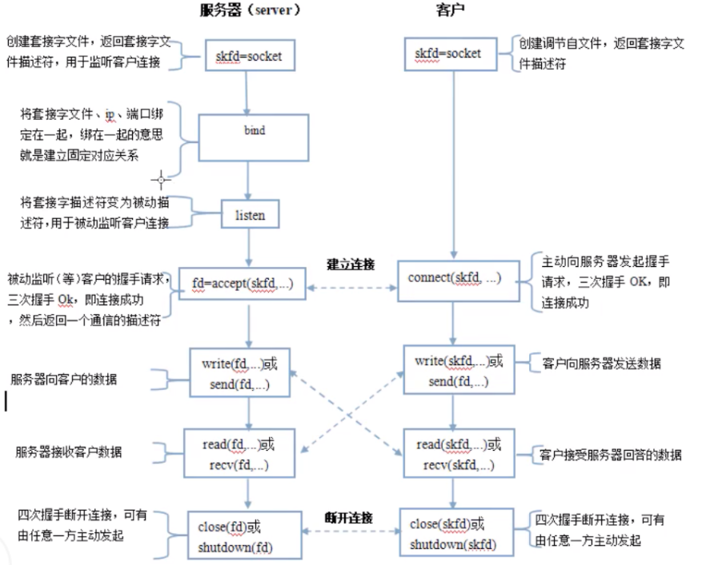

##### recv

```C++
//原型
ssize_t recv(int sockfd, void *buf, size_t len, int flags);
```

该函数第一个参数指定接收端套接字描述符;

第二个参数指明一个缓冲区，该缓冲区用来存放recv函数接收到的数据;

第三个参数指明缓冲区buf的长度;

第四个参数一般置0; （标志位）

**tips:** recv函数返回其实际copy的字节数（第四个参数为0的时候， 其实是剪切数据， 而不是copy数据）。如果recv在copy时出错，那么它返回SOCKET_ERROR; 如果recv函数在等待协议接收数据时网络中断了，那么它返回0(比如对端close socket);recv函数仅仅是copy数据， 真正的接收数据是协议来完成的（发送数据要靠协议栈）。

**返回说明：**
a. 成功执行时，返回接收到的字节数。另一端已关闭则返回0。

b. 失败返回-1，errno被设为以下的某个值
EAGAIN：套接字已标记为非阻塞，而接收操作被阻塞或者接收超时
EBADF：sock不是有效的描述词
ECONNREFUSE：远程主机阻绝网络连接
EFAULT：内存空间访问出错
EINTR：操作被信号中断
EINVAL：参数无效
ENOMEM：内存不足
ENOTCONN：与面向连接关联的套接字尚未被连接上
ENOTSOCK：sock索引的不是套接字

c. 当返回值是0时，为正常关闭连接；

##### 格式转换

- int **inet_aton**(const char *strptr,struct in_addr *addrptr)

    将strptr所指C字符串转换成一个32位的网络字节序二进制值，并同过addrptr指针来存储，成功返回1，失败返回0

- int_addr_t **inet_addr**(const char *strptr)

    进行相同的转化，返回值为32位的网络字节序二进制，但是255.255.255.255不能由此函数处理，因为出错时该函数返回全1

- char ***inet_ntoa**(struct in_addr inaddr)

    将一个32位的网络字节序二进制IPv4地址转换成相应的点分十进制数串,由该函数的返回值所指向的字符串驻留在静态内存中,这意味着该函数是不可重入的

#### 进程编程

##### [共享内存](https://www.169it.com/article/6012387511881523440.html)

**shmget函数：int shmget(key_t key, size_t size, int shmflg); **

​		第一个参数，与信号量的semget函数一样，程序需要提供一个参数key（非0整数），它有效地为共享内存段命名。

​		第二个参数，size以字节为单位指定需要共享的内存容量。

​		第三个参数，shmflg是权限标志，它的作用与open函数的mode参数一样，如果要想在key标识的共享内存不存在时，创建它的话，可以与IPC_CREAT做或操作。共享内存的权限标志与文件的读写权限一样，举例来说，0644，它表示允许一个进程创建的共享内存被内存创建者所拥有的进程向共享内存读取和写入数据，同时其他用户创建的进程只能读取共享内存。

​		shmget函数成功时返回一个与key相关的共享内存标识符（非负整数），用于后续的共享内存函数。调用失败返回-1。不相关的进程可以通过该函数的返回值访问同一共享内存，它代表程序可能要使用的某个资源，程序对所有共享内存的访问都是间接的，程序先通过调用shmget函数并提供一个键，再由系统生成一个相应的共享内存标识符（shmget函数的返回值），只有shmget函数才直接使用信号量键，所有其他的信号量函数使用由semget函数返回的信号量标识符。

**shmat函数：void *shmat(int shm_id, const void *shm_addr, int shmflg);  **

​		第一次创建完共享内存时，它还不能被任何进程访问，shmat函数的作用就是用来启动对该共享内存的访问，并把共享内存连接到当前进程的地址空间。

​		第一个参数，shm_id是由shmget函数返回的共享内存标识。

​		第二个参数，shm_addr指定共享内存连接到当前进程中的地址位置，通常为空，表示让系统来选择共享内存的地址。

​		第三个参数，shm_flg是一组标志位，通常为0。

调用成功时返回一个指向共享内存第一个字节的指针，如果调用失败返回-1。

**shmdt函数：int shmdt(const void *shmaddr);**

​		该函数用于将共享内存从当前进程中分离。注意，将共享内存分离并不是删除它，只是使该共享内存对当前进程不再可用。

​		参数shmaddr是shmat函数返回的地址指针，调用成功时返回0，失败时返回-1。

**shmctl函数：int shmctl(int shm_id, int command, struct shmid_ds *buf);**  

第一个参数，shm_id是shmget函数返回的共享内存标识符。

第二个参数，command是要采取的操作，它可以取下面的三个值 ：

- IPC_STAT：把shmid_ds结构中的数据设置为共享内存的当前关联值，即用共享内存的当前关联值覆盖shmid_ds的值。
- IPC_SET：如果进程有足够的权限，就把共享内存的当前关联值设置为shmid_ds结构中给出的值
- IPC_RMID：删除共享内存段

第三个参数，buf是一个结构指针，它指向共享内存模式和访问权限的结构。
shmid_ds结构至少包括以下成员：

```C++
struct shmid_ds  
{  
    uid_t shm_perm.uid;  
    uid_t shm_perm.gid;  
    mode_t shm_perm.mode;  
};  
```


#### epoll函数

##### epoll_create函数

函数声明：int epoll_create(int size)

该函数生成一个epoll专用的文件描述符。它其实是在内核申请一空间，用来存放你想关注的socket fd上是否发生以及发生了什么事件。size就是你在这个epoll fd上能关注的最大socket fd数。随你定好了。只要你有空间。

##### epoll_ctl函数

函数声明：int epoll_ctl(int epfd, int op, int fd, struct epoll_event *event)

该函数用于控制某个epoll文件描述符上的事件，可以注册事件，修改事件，删除事件。

参数：

epfd：由 epoll_create 生成的epoll专用的文件描述符；

op：要进行的操作例如注册事件，可能的取值EPOLL_CTL_ADD 注册、EPOLL_CTL_MOD 修 改、EPOLL_CTL_DEL 删除

fd：关联的文件描述符；
event：指向epoll_event的指针；
如果调用成功返回0,不成功返回-1

用到的数据结构

```c++
typedef union epoll_data {
void *ptr;
int fd;
__uint32_t u32;

__uint64_t u64;
} epoll_data_t;

struct epoll_event {
__uint32_t events; /* Epoll events */
epoll_data_t data; /* User data variable */
};

如：
struct epoll_event ev;
//设置与要处理的事件相关的文件描述符
ev.data.fd=listenfd;
//设置要处理的事件类型
ev.events=EPOLLIN|EPOLLET;
//注册epoll事件
epoll_ctl(epfd,EPOLL_CTL_ADD,listenfd,&ev);
```

常用的事件类型:
EPOLLIN ：表示对应的文件描述符可以读；
EPOLLOUT：表示对应的文件描述符可以写；
EPOLLPRI：表示对应的文件描述符有紧急的数据可读
EPOLLERR：表示对应的文件描述符发生错误；
EPOLLHUP：表示对应的文件描述符被挂断；
EPOLLET：表示对应的文件描述符有事件发生；

##### epoll_wait函数

函数声明:int epoll_wait(int epfd,struct epoll_event * events,int maxevents,int timeout)

该函数用于轮询I/O事件的发生；

参数：

epfd:由epoll_create 生成的epoll专用的文件描述符；

epoll_event:用于回传代处理事件的数组；

maxevents:每次能处理的事件数；

timeout:等待I/O事件发生的超时值(单位我也不太清楚)；-1相当于阻塞，0相当于非阻塞。一般用-1即可返回发生事件数。

### MORE

#### argc、argv

argc和argv参数在用命令行编译程序时有用。在main( int argc, char* argv[],  ) 中，
		第一个参数，int型的argc，为整型，用来统计程序运行时发送给main函数的命令行参数的个数，在VS中默认值为1。
		第二个参数，char*型的argv[]，为字符串数组，用来存放指向的字符串参数的指针数组，每一个元素指向一个参数。各成员含义如下：

1. argv[0]指向程序运行的全路径名
2. argv[1]指向在DOS命令行中执行程序名后的第一个字符串
3. argv[2]指向执行程序名后的第二个字符串
4. argv[3]指向执行程序名后的第三个字符串
5. argv[argc]为NULL

#### cout、cerr

- cout：写到标准输出的ostream对象；缓存后输出；
- cerr：输出到标准错误的ostream对象，常用于程序错误信息；非缓存，直接输出，只输出到显示器。

#### struct、class

struct和class基本是通用的，唯有几个细节不同：

- 在使⽤class时，类中的成员默认都是private属性的；而使⽤struct时，结构体中的成员默认都是Public属性
    的
- class可以使用模板，而struct不行
- class有this，而struct没有

#### struct、union

1. 在存储多个成员信息的时候，编译器会自动给struct的成员分配存储空间，struct可以存储多个成员信息，⽽
union每个成员会⽤同⼀个存储空间，只能存储最后⼀个成员的信息。
2. 都是由多个不同的数据类型成员组成，但在任何时刻，union只存放⼀个被先选中的成员，⽽结构体的所有成
员都存在。
3. 对于union的不同成员赋值，将会对其他成员重写，原来成员的值就不存在了。

#### define、const

关于define和const的区别，⽤⼀段程序说明：

```C++
include<iostream>

using namespace std;
int main()
{
int num = 1;

#define t1 num + num
#define t2 t1 % t1

cout << "t2 is " << t2 << endl; // t2 is 2
const int s1 = num + num;
const int s2 = s1 % s1;
cout << "s2 is " << s2 << endl; // s2 is 0
return 0;
}
```

为什么t2是2，⽽s2是正确结果的0呢？这就涉及到了define和const的差别。

分析原因：const定义的常量s1、s2，则s1的值是num+num，s2的值是s1%s1，所以最后结果为“s2 is 0”；⽽
define定义的变量作替换后，C++把cout<<"t2 is "<<t2<<endl;语句译成了：cout<<"t2 is <<num+num%num+num<<endl;所以结果为"t2 is 2"（1+0+1=2）

具体分析const与define的区别，有⼏个⽅⾯：

```c++
const float pi = 3.14;
#define pi 3.14
```

- 类型安全性检查上，使用const定义的常量是具有数据类型的，在定义或者使用的时候，编译器会对其进行类
    型安全检查，而使用define定义的宏常量，只会进行简单的字符替换，并不会有数据类型。
- 调度上，部分调度⼯具可以对const常量进⾏调度，而不能对宏常量进行调度。
- 编译器的处理方式不同，define的宏常量是在预处理阶段进行展开的，而const常量则是编译运行阶段使用。
- 内存存储方式，const常量会在内存中被分配地址，而define定义的宏只会在遇到的时候进行展开。

#### new、malloc

- **new**

在使用new来创建⼀个对象的时候，流程如下：
1. 首先使⽤malloc（也可以不是malloc，结合自由存储区的理解，主要取决于运算符new的实现）来为该对象在自由存储区中分配对应大小的空间。
2. 调⽤该对象所属类的构造函数。
3. 返回指向该对象的指针。

​        所谓的自由存储区，是C++基于new操作符的⼀个**抽象概念**，凡是通过new操作符进行内存申请，这块内存就是自由存储区。⾃由存储区可以等于堆，也可以不等于堆，取决于new内对于内存的分配方式。

- **malloc**

malloc是一个库函数，通过操作系统调用在内存的堆区分配空间。

[malloc底层实现原理](https://blog.csdn.net/vivitue/article/details/78266839)

#### const、static用法

​		对于C++来讲，const就是只读的意思，只在声明中使⽤；

​		static有两个作用，规定作用域和存储⽅式。对于局部变量，static规定其为静态存储方式，每次调用的初始值为上⼀次调用的值，调用结束后存储空间不释放。

​		对于全局变量，如果以⽂件划分作用域的话，此变量只在当前⽂件中可见；对于static函数也是只在当前模块内函数可见。
​		static const是上面两者的合集。
**const的用法**

1. 在定义的时候必须进行初始化
2. 定义为const的形参，即在函数内部是不能被修改的
3. 类的成员函数可以被声明为常成员函数，不能修改类的成员变量。
4. 类的成员函数可以返回的是常对象，即被const声明的对象
5. 类的成员变量是常成员变量，不能在声明时初始化，必须在构造函数的列表里进行初始化
6. **关于 int * const , int const * 等等，只需要看const后面接的是什么，接的是什么就是什么常量（int等类型修饰符忽略）**

**const如何做到只读？**

这些在编译期完成，对于内置类型，如int，编译器可能使用常数直接替换掉对此变量的引用。

**static的用法**

1. 在函数体内，⼀个被声明的变量在这⼀函数被调⽤过程中维持其值不变。
2. 在模块内，⼀个被声明为静态的变量可以被模块内所⽤函数访问，但不能被模块外其他函数访问，相当于⼀
  个本地的全局变量。
3. 在模块内，⼀个被声明为静态的函数只可被这⼀模块内的其他函数调⽤。
4. 类中的static成员变量属于整个类所拥有，不能在类内进行定义，只能在类的作用域内进行定义。
5. 类内的static成员函数属于整个类所拥有，不能包含this指针，只能调用static成员函数。

#### volatile

​		volatile关键字是⼀种类型修饰符，用它声明的类型变量表示可能被某些编译器未知的因素更改、优化。所以使⽤volatile关键字告诉编译器不应对这样的对象进行优化。
​		volatile关键字声明的变量，每次访问必须从内存中取出值(没有被修饰的变量，可能由于编译器的优化，从CPU寄存器中取值)

#### MOVE语义

要理解C++11的move语义，就需要理解C++中的左值和右值和临时对象的概念。

**1.左值与右值和临时对象：**
简单地说：=左边的变量就是左值，=号右边的值就是右值。
更加深⼊⼀点讲就是：在多条代码中都可以使⽤，都是左值。右值是指临时的对象，只在当前的语句中有效。

```C++
	int i = 1； // i是左值, 1是右值
	int b = i + 1; // b是左值， (i+1) 会产⽣⼀个临时对象来接受 i+1的计算的结果，这个临时对象是右值，						这个临时对象我们看不到，但是编译器会⽣成

	int fun( int&x ){
		int a = x+ 1;
		return a;
	}
	x = fun(b); //这⾥注意， 要想将这个返回值a传递给左值的x，那么这⾥我们看不到的，但是编译器做的⼯作，					他会⽤⼀个临时变量来存储这个 fun（b）的返回值。然后将这个临时变量赋值给 x;
```

​		总结⼀下：左值就是等号左边⽤于接受对象的变量，右值就是等号右边的常量或者表达式计算出来的结果存放的临时对象。

举个例子：

**2.move语义**
		只要了解了左右值，其实就可以理解C++11的move了，⾸先C++11提出move语义的初衷就是为了把临时变量变得可以使⽤，从而减少在运行时有多次构造和析构的代价，从而提高性能。

#### 原子操作

​		原子操作是平台相关的，原子类型能够实现原子操作是因为C++11对原子类型的操作进行了抽象，定义了统⼀的接口，并要求编译器产生平台相关的原子操作的具体实现。C++11标准将原子操作定义为atomic模板类的成员函数，包括读写、交换等。对于内置类型来说，主要是通过重载⼀些全局操作符来完成。

​		C++11原子操作通过类型的定义来实现，即将类型定义为原子类型，编译器即保证允许时是原子性的，意味着多线程的时候该资源是互斥的，且这样比手动加锁效率更高！

```C++
#include <atomic>
#include <thread>
#include <iostream>
using namespace std;
atomic_int64_t total = 0; //atomic_int64_t相当于int64_t，但是本身就拥有原⼦性
//atomic_int a;
//atomic_char b;
//atomic_bool c;

//线程函数，⽤于累加
void threadFunc(int64_t endNum)
{
	for (int64_t i = 1; i <= endNum; ++i){
		total += i;
	}
}
int main()
{
	int64_t endNum = 100;
	thread t1(threadFunc, endNum);
	thread t2(threadFunc, endNum);
	t1.join();
	t2.join();
	cout << "total=" << total << endl; 
}
```

#### 指针和引用的区别

- 指针储存的是原变量的地址，本质上也是⼀个变量，变量上的存储地址是存储对象的地址。而引用本质上是和变量是⼀个东西，只不过是变量的⼀个别名。
- 指针可以有const指针，但是没有const引用；
- 指针可以有多级，但是引用只能是⼀级（int **p是合法的而 int &&a是不合法的）
- 指针的值可以为空，但是引用的值不能为NULL，并且引用在定义的时候必须初始化；
- 指针的值在初始化后可以改变，即指向其它的存储单元，而引用在进行初始化后就不会再改变了。
- "sizeof引用"得到的是所指向的变量(对象)的大小，而"sizeof指针"得到的是指针本身的大小；
- 指针和引用的自增(++)运算意义不⼀样；

#### 函数指针指针函数

- **指针函数**

指针函数，简单的来说，就是一个返回指针的函数，其本质是一个函数，而该函数的返回值是一个指针。声明为指针函数之后，可以使同类型的指针指向该函数，然后运用指针对函数进行操作，如下：

```C++
typedef struct _Data{
    int a;
    int b;
}Data;

//指针函数
Data* f(int a,int b){
    Data * data = new Data;
    data->a = a;
    data->b = b;
    return data;
}

int main(int argc, char *argv[])
{
    QApplication a(argc, argv);
    //调用指针函数
    Data * myData = f(4,5);
    qDebug() << "f(4,5) = " << myData->a << myData->b;

    return a.exec();
}
```

- **函数指针**

1. 函数指针，其本质是一个指针变量，该指针指向这个函数。总结来说，函数指针就是指向函数的指针。
2. 函数指针定义时需要加函数类型、*号和对应的参数，只有参数列表相同才可以把函数地址赋值给函数指针。
3. 当参数需要使用函数时，需要使用函数指针

```c++

int sub(int x,int y){
    return x-y;
}
//函数指针
int (*fun)(int x,int y);

int main(int argc, char *argv[])
{
    fun = &sub;
    qDebug() << "(*fun)(5,3) = " << (*fun)(5,3)  << fun(5,3)；

    return a.exec();
}
```


#### 类型转换

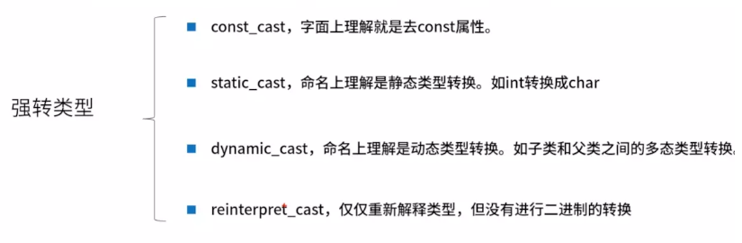

**要点：**

1. const_cast就是去掉const属性，如果是要加上const属性直接隐式转换即可

```c++
 const int i = 10;
 int *p = const_cast<int*>(&i);
```

2. static_cast就是普通的类型转换，如int转char；可以转换自定义类型。如果涉及到类，static_cast只能在有相互联系（继承）的类型间进行转换，**且不一定包含虚函数**。

```c++
//相当于创建一个static_cast<double>类型的匿名对象赋值给d2
int i = 10;
double d2 = static_cast<double>(i);
```

3. reinterpret_cast是强制类型转换，重新解释类型，什么都可以转

```C++
//此处为int类型转换成int* 
int i = 10;
int* p2 = reinterpret_cast<int*>(i);
```

4. 用于父类和子类之间的类型转换，使用dynamic_cast进行转换时，基类中一定要有虚函数。**可以子类转成父类（直接转换使用即可，多态的特性），父类转换成子类的时候，需要父类指针指向的是子类，否则无法转换。**

#### 回调函数

- **普通函数：**你所写的函数调用系统函数，你只管调用，不管实现
- **回调函数：**系统调用你所写的函数，你只管实现，不管调用。
- **运行逻辑：**主程序只负责调用宿主函数，不关心回调函数何时被调用

#### 内联函数

将函数体直接展开，省去函数调用的开销，inline只是建议，具体是否展开取决于编译器

编译器对inline函数展开的步骤：

1. 将inline函数体移动到inline函数调用处
2. 为Inline函数局部变量分配空间
3. 将inline函数的输入参数跟返回值映射到调用方法的局部变量空间
4. 如果 inline 函数有多个返回点，将其转变为 inline 函数代码块末尾的分支（使用 GOTO）

inline有2个好处跟3个缺点

1. 好处
   - 省去函数调用的开销
   - 编译器会对inline函数进行优化
2. 坏处
   - 过分使用inline会造成代码膨胀，会消耗更多的内存，造成系统性能下降
   - 如果函数体内出现循环，那么执行函数体内代码的时间要比函数调用的开销大
   - inline修改时，包含其头文件的都需要重新编译，无法降低编译依存性
   - inline函数无法使用断点调试

值得注意的是：程序员可以隐式或者显式生明inline函数，但是具体执行与否取决于编译器，inline函数一般不能修饰虚构函数，因为虚构函数会在运行时多态联编，而inline是编译期间展开，只有在虚函数不表现多态性时才可以用inline。

#### 文件描述符

文件描述符为一个非负整数，用来标识一个文件。

#### 多态和虚函数

**动态多态：**在任何其基类对象使用的地方，都可以用其子类代替，这就是C++的多态性

**静态多态**：也称编译时多态，主要包括模板和重载

**虚函数：**

1.在运用C++的多态性时经常用到虚函数，即基类函数中需要声明为虚函数才能实现动态绑定，即运行时才确定使用哪个子类的函数。需要声明为虚函数的基类函数，一般需要子类的重新实现。若基类函数中完全不进行有意义的实现，该虚函数称为纯函数。

2.不给出具体实现的虚函数叫纯虚函数，子类中必须给出纯虚函数的实现。抽象类是指包括⾄少⼀个纯虚函数的类。

3.存在虚函数的类都有⼀个虚函数表叫做虚表，类的对象有⼀个指向虚表开始的虚指针。虚表和类是对应的，虚表指针和对象是对应的。

4.每⼀个对象内部都有⼀个虚表指针，该虚表指针被初始化为本类的虚表。所以在程序中，不管你的对象类型如何转换，但该对象内部的虚表指针是固定的，所以才能实现动态的对象函数调用。

```c++
class Shape {
   public:
      //虚函数
      virtual int myarea()
      {
         cout << "Parent class area :" <<endl;
         return 0;
      }
      //纯虚函数
      virtual int area() = 0;
};
```

**虚函数的实现过程：**

​		编译器在编译的时候，发现父类有虚函数，此时编译器便会为每个包含虚函数的类创建⼀个虚表，在表中存放每个虚函数的地址，并且每个类对象中还提供了⼀个指针指向该虚表。
​		在程序运行时，根据对象的类型去初始化虚表指针，从而让其正确的指向所属类的虚表，从而在调用虚函数的时候，能够正确的找到函数。
​		正是由于每个对象调用的虚函数都是通过虚表指针来索引的，也就决定了虚表指针的正确初始化是非常重要的，换句话说，在虚表指针没有正确初始化之前，我们不能够去调用虚函数，那么虚表指针是在什么时候，或者什么地方初始化呢？
​		答案是在构造函数中进行虚表的创建和虚表指针的初始化，在构造子类对象时，要先调用⽗类的构造函数，此时编译器只“看到了”父类，并不知道后面是否还有继承者，它初始化父类对象的虚表指针，该虚表指针指向父类的虚表，当执行子类的构造函数时，子类对象的虚表指针被初始化，指向自身的虚表。

**为什么基类的析构函数需要定义为虚函数：**

​		当继承类对象经由⼀个基类指针被删除，若基类是非虚的析构函数，则会导致只调用了基类的析构函数，继承类的成分没有被销毁，造成局部销毁对象，形成资源泄漏，败坏数据结构。
​		当⼀个类不被当做基类、或者不具有多态性时，令其析构函数为虚函数是多余的，浪费内存。

**构造函数为什么一般不定义为虚函数：**

​		虚函数的作用在于通过父类的指针或者引用来调用它的时候能够变成调用子类的那个成员函数。 而构造函数是在创建对象时自动调用的，不可能通过父类的指针或者引用去调用，因此也就规定构造函数不能是虚函数。

**构造函数中调用虚函数会怎样：**

​		第⼀个原因，在概念上，构造函数的工作是为对象进行初始化。在构造函数完成之前，被构造的对象被认为“未完全生成”。当创建某个派生类的对象时，如果在它的基类的构造函数中调用虚函数，那么此时派⽣类的构造函数并未执行，所调用的函数可能操作还没有被初始化的成员，将导致灾难的发生。
​		第⼆个原因，即使想在构造函数中实现动态联编，在实现上也会遇到困难。这涉及到对象虚指针（vptr）的建立问题。⼀个类的构造函数在执行时，并不能保证该函数所能访问到的虚指针就是当前被构造对象最后所拥有的虚指针，因为后面派⽣类的构造函数会对当前被构造对象的虚指针进行重写，因此无法完成动态联编。
​		所以，在构造函数中调用虚函数，虚函数会变成实调⽤。

#### 重载和重写

**重载：**函数名相同，函数的参数个数、参数类型或参数顺序三者中必须⾄少有⼀个不同。函数返回值的类型可以相同，也可以不相同。发⽣在⼀个类的内部。
**重写：**也叫做覆盖，⼀般发⽣在⼦类和⽗类的继承关系之间。⼦类重新定义⽗类中有相同名称和参数的虚函数。

重写需要注意：

1. 被重写的函数不能是static的。必须是virtual的。
2. 重写函数必须有相同的类型，名称和参数列表。
3. 重新函数的访问修饰符可以不同。

#### 浅拷贝和深拷贝

浅拷贝实际上是对类成员的引⽤，深拷贝是对类成员的复制并且重新分配了内存。

#### 封装、继承、多态

**封装，继承，多态，这三者的意义分别是什么，这样做优势在哪？**

**封装：**封装是一种信息隐蔽技术，它体现于类的说明，是对象的重要特性。封装使数据和加工该数据的方法（函数）封装为一个整体，以实现独立性很强的模块，使得用户只能见到对象的外特性（对象能接受哪些消息，具有哪些处理能力），而对象的内特性（保存内部状态的私有数据和实现加工能力的算法）对用户是隐蔽的。封装的目的在于把对象的设计者和对象的使用者分开，使用者不必知晓其行为实现的细节，只须用设计者提供的消息来访问该对象。

**继承：**继承性是子类共享其父类数据和方法的机制。它由类的派生功能体现。一个类直接继承其他类的全部描述，同时可修改和扩充。继承具有传递性。继承分为单继承（一个子类有一父类）和多重继承（一个类有多个父类）。类的对象是各自封闭的，如果没继承性机制，则类的对象中的数据、方法就会出现大量重复。继承不仅支持系统的可重用性，而且还促进系统的可扩充性。

**多态：**对象根据所接收的消息而做出动作。同一消息被不同的对象接受时可产生完全不同的行动，这种现象称为多态性。利用多态性用户可发送一个通用的信息，而将所有的实现细节都留给接受消息的对象自行决定，如是，同一消息即可调用不同的方法。使用多态有三个优点：1.组织结构清晰 2.可读性强 3.易于扩展，可维护性高

#### 对象复用

​        如果⼀个对象的创建⾮常耗时或者代价⾮常昂贵，频繁去创建的话会⾮常低效。对象池通过对象复⽤的⽅式来避免重复创建对象，它会事先创建⼀定数量的对象放到池中，当⽤⼾需要创建对象的时候，直接从对象池中获取，⽤完对象后在放回对象池中，以便复⽤。这种⽅式避免了重复创建耗时或消耗资源的⼤对象，⼤幅提⾼了程序性能。

#### 面向对象的五大原则

1. **单一职责原则SRP：**
是指⼀个类的功能要单⼀，不能包罗万象。如同⼀个人⼀样，分配的⼯作不能太多，否则⼀天到晚虽然忙碌，但效率⾼不起来。⽐如⼀个职员类，如果将⼯程师，销售⼈员，销售经理都放在这个类⾥⾯，每个⽅法都需要⽤if else来进⾏判断是哪种情况，结构臃肿，且⽆论哪⼀个成员发⽣需求变化，就会改变整个职员类。
2. **开闭原则：**
⼀个模块在扩展性方面应该是开放的⽽在更改性⽅⾯应该是封闭的。⽐如：⼀个⽹络模块，原来只有服务端功能，而现在要加⼊客户端功能，那么应当在不⽤修改服务端功能代码的前提下，就能够增加客⼾端功能的实现代码。这要求在设计之初，就应当将服务端和客⼾端分开，公共部分抽象出来。
3. **里式替换原则**
⼦类应当可以替换⽗类并出现在⽗类能够出现的任何地⽅。这是因为当⼦类可以替换⽗类，⽽软件单位的功能不受到影响的时候，基类才能真正被复⽤，⽽⼦类也能在基类的基础上增加新的⾏为。
4. **依赖倒置原则**
    高层次不应依赖于低层次，应依赖于抽象；抽象不应依赖于具体的实现，具体的实现依赖抽象。因为抽象变化的概率比较小，即使实现细节在发⽣不断的变化，只要抽象不变，程序就不需要发⽣变化。
5. **接口分离原则**
模块间要通过抽象接⼝隔离开，⽽不是通过具体的类强耦合起来；使⽤多个专⻔的借⼝⽐使⽤单个接⼝好得多，这样在实现和维护接⼝上会省去很多精⼒；⼀个接⼝最好只提供⼀类对外功能。

#### 模板元编程

​		由于模板元编程执行于C++编译期，因此可将工作从运行期转移到编译期，这导致的结果是，某些错误原本通常在运行期才能侦测到，现在可在编译期找到。另外使用模板元编程的C++程序可能在每一方面都更高效：较小的可执行文件、较短的运行期、较小的内存需求，然而将工作从运行期转移到编译期的另一个结果是，编译时间变长了。

#### 初始化成员列表

​		成员初始化列表就是在类的构造函数后⾯，紧跟着使⽤冒号和括号来初始化成员的⼀个列表，它在C++定义中的类型的初始化和在构造函数内部初始化的性能没什么区别；使用情况有如下两点：

1. type和model都是常量，可以初始化但不能赋值，如果试图在构造函数的函数体中进行如  type = "xxx";之类的 赋值，将会报错。
2. 但是若类中成员含有C++未定义的类型成员的话，则使⽤成员初始化列表的性能会⽐在构造函数中初始化的效率⾼。

```C++
class test{
private:
	String a;
	const int b;
public:
	test(){
	a = "123";
	//b = 1;  错误，无法复制
	}
}
//编译器扩张⾏为
test(){
	a.String()； // 初始化对象
	String cur = String("123");
	a = cur;
	cur.~String();
	//b = 1;
}
//若使⽤初始化列表
test():a("123"),b(1){
	a.String("123"); // 扩充
    //b在进入构造函数之前已被初始化（编译时）
}
```


## 计算机网络

**计算机网络体系分类：** 计算机网络整个体系有两个大的分类：一个是国际组织制定的OSI七层模型，一种是实际使用中的TCP/IP四层模型。

| OSI七层模型 | TCP/IP四层模型 | 协议               |
| ----------- | -------------- | ------------------ |
| 应用层      |                |                    |
| 表示层      | 应用层         | HTTP/FTP/DNS       |
| 会话层      |                |                    |
| 传输层      | 传输层         | TCP/UDP            |
| 网络层      | 网络层         | ICMP/IGMP、IP、ARP |
| 数据链路层  | 网络接口层     |                    |
| 物理层      |                |                    |

### 物理层 

   	 物理层主要是实现主机和网络之间的物理连接，规定一些与传输媒体接口有关的一些特性。

------

**通信方式**

- **单工通信：**只能由A主机向B主机发送消息，通信是单向的。
- **半双工通信：**同一时间只能是由A主机向B主机或者是B主机向A主机发送信息，不能同时发送消息。
- **全双工通信：** A主机和B主机可以实现在同一时间内既接收消息，又发送消息，极大的提升了通信效率。

------

**常见引导型传输媒体** 

- **双绞线：** 分为屏蔽双绞线（STP）和非屏蔽双绞线（UTP），屏蔽双绞线就是在非屏蔽双绞线外边又加了一层屏蔽层（为什么双绞线要两根线绞起来：两个线绞起来可以有效的减少相互之间的电磁干扰）
- **同轴电缆：** 由内导体铜制芯线，绝缘层，网状编织的外导体屏蔽层，以及塑料保护外层组成。有良好的抗干扰性，被广泛用于较高速率的传输。
- **光缆：** 由非常透明的石英玻璃拉成细丝，主要由纤芯和包层构成双层通讯柱。可以分为单模光纤和多模光纤。

------

**信道复用技术**

- **频分复用：**根据传输的波的频率的不同，将不同频段的波用于不同的通信。
- **时分复用：**将时间分割为时间段，规定在某个时间段内发送什么样的信息，根据时间段来进行信息类别的区分。也称为同步时分复用
- **统计时分复用：**基于时分复用的一种改进，由于基本的时分复用并没有考虑到每个时间段内是否有信息发出，例如说每个时间段是20，但是发送消息只占用其中的2，那么剩下的18就处于空闲时间。统计时分复用就是基于这种考虑而设计的，他允许用户有数据时就将数据发送到缓存中，然后会依次扫描输入缓存，把缓存中的数据放入到STMD帧中，若没有就跳过，每当一个帧满了就把这个帧发出去。STMD帧不是分配的固定时序，而是根据需要动态的分配时隙，也称之为异步时分复用
- **光分复用：**就是光的频分复用，根据光谱中频率的不同，用不同频率的光来携带不同的信息。

------

### 数据链路层

​     	数据链路层主要是将上层的数据转化为数据帧发送到链路上，以及把接受到的帧中的数据取出并交给网络层。

------

**通信方式：**

- **点对点通信：**通信方式是点到点的，也就是只能是两个点之间的通信。常见的就是PPP协议
- **广播通信：**广播通讯，也就是可以同时实现一对多的通信。常见的就是CSMA/CD（载波监听多点访问/冲突检测）

------

**核心要解决的问题：**

- **封装成帧：**在一段数据的前后分别添加首部和尾部，这样就构成了一个帧。接收端在接受到后就可以方便准确的确定帧的首尾，也称为帧定界符。同时定义出了最大传输单元（MTU）--表示一次可以传输的最大长度上限。
- **透明传输：** 由于使用特定的字符来表示帧的开始和结束，所以传输的内容中不能出现和帧定界符相同的字符，但这显然是不可能的，为了解决这个办法，就可以在内容中和帧定界符一样的字符前边加上规定好的转义字符，这种方法称为字符填充或者是字节填充。
- **差错检测：** 比特在传输过程中可能产生差错，差错检测就是用于检测出现的差错，以便及时的重传，最常用的差错检测算法就是[CRC（循环冗余检验）](http://baike.sogou.com/v7730112.htm?fromTitle=CRC%E6%A0%A1%E9%AA%8C)

------

### 网络层

​		网络层主要是向上只提供简单灵活的，无连接的，尽最大努力交付的数据报服务。

#### IP协议（网际协议）

​		IP协议是TCP/IP体系中最主要的协议之一，一切在IP之下，一切又在IP之上。我们常说的应该是IP协议族，还包含配套的协议：

- **ARP（地址解析协议）**

[ARP协议](https://blog.csdn.net/jiejiemcu/article/details/88406088)将网络的IP地址转化为实际的物理地址（MAC地址），并存储在MAC地址表中。

1. 当需要向局域网内的IP发送数据时，直接广播一个ARP请求，符合的IP会将自己的物理地址发回给请求方，从而获得了目标IP的物理地址
2. 当向公网的IP发送数据时，先获取网关的mac地址并发送数据给网关，网关再经过层层的IP查询和mac地址获取，进行数据的转发，最终转发到目标IP上
3. 为了加快访问速度，每一部电脑都会有一个ARP缓存表，在一定的时间缓存最近访问过的ip地址与mac地址的映射表，再次访问时可以快速发送。

- **ICMP（网际控制报文协议）**：用于进行差错情况和异常情况的反馈，分为询问报文和差错报告报文。
- **IGMP（网际组管理协议）**：用于控制和管理多播和组播的协议。

#### 子网掩码

​		子网掩码(subnet mask)又叫网络掩码、地址掩码、子网络遮罩，它是一种用来指明一个IP地址的哪些位标识的是主机所在的子网，以及哪些位标识的是主机的位掩码。子网掩码不能单独存在，它必须结合IP地址一起使用。

- **功能：**

1. **将某个IP地址划分成网络地址和主机地址两部分**：可以标识该IP地址是在局域网上，还是在远程网上。
2. **减少网络上的通信量**：使用子网掩码划分子网后，子网内可以通信，跨子网不能通信，子网间通信应该使用路由器。因此可减少网络上的通信量。
3. **减少IP的浪费，便于管理**：若无子网划分，IP的分配难以界定，有些区域划分了比较多的IP，但是有很多空闲IP未使用，而有些地区则是IP不足，造成了分配不均匀，IP浪费，子网掩码的产生可层层交付管理，大的网络号交给大运营商分配，小的网络号交给小企业分配。而网络号又可以划分更小的子网，组成更小的局域网，从而进行IP地址的更好利用

#### 网络地址

| 概念      | 网络范围                     | 默认掩码         | 说明                       |
| :-------- | :--------------------------- | :--------------- | -------------------------- |
| A类地址   | 0.0.0.0 -127.255.255.255     | 255.0.0.0/8      | 用于少量的大型网络         |
| B类地址   | 128.0.0.0 -191.255.255.255   | 255.255.0.0/16   | 用于中等规模的网络         |
| C类地址   | 192.0.0.0 - 223.255.255.255  | 255.255.255.0/24 | 用于小规模的网络           |
| D类地址   | 224.0.0.0 - 239.255.255.255  | 无子网掩码       | 用于多播地址               |
| E类地址   | 240.0.0.0 - 247.255.255.255  | 无子网掩码       | 保留地址，可以用于实验目的 |
| A类私有IP | 10.0.0.0～10.255.255.255     | 255.0.0.0/8      | 私有网段，无法上网         |
| B类私有IP | 172.16.0.0～172.31.255.255   | 255.255.0.0/16   | 私有网段，无法上网         |
| C类私有IP | 192.168.0.0～192.168.255.255 | 255.255.255.0/24 | 私有网段，无法上网         |

##### 网络地址的理解

- 私有号段（192.168.0.0/172.16.0.0/10.0.0.0）即私有地址，无法所有IP地址都可使用该号段，且互不相关，也不能与外界通网，该部分地址仅作为私有地址，无法作为网络地址
- 子网掩码仅为区分网络号和主机号，网络号的不同范围大小提供给需求不同的用户，比如B类地址分给一个大运营商，如广东电信（183.42.0.0 - 183.42.255.255）（子网掩码为/16），电信可以再进行子网划分，把IP地址分给不同的用户（区域），如肇庆电信分到了（183.42.0.0 - 183.42.0.255）（子网掩码为/24），然后肇庆电信又可以进行子网划分，如怀集梁村电信分到（183.42.0.32 - 183.42.0.47）（子网掩码为/28），然后梁村电信就是一个最小的局域网了，局域网内有16个主机IP，网络号都是183.42.0.32，同网络号里面可以通信，网络号外需要借助路由器，借助路由器可以访问到肇庆电信所属的网络号，然后再访问外面的需要更大的网关，依此类推。
- 那么梁村电信只有16个IP怎么够用呢？这就涉及到了NAT技术，即利用保留的私有地址，分配给局域网内的不同用户，然后利用NAT技术，上网的时候把私有IP转换成网络地址，再进行上网。

#### 路由选择协议

路由选择协议分为内部网关协议（IGP）和外部网关协议（EGP）

- **内部网关协议：**主要是有RIP协议和OSPF协议
    - RIP协议（路由信息协议）：基于距离矢量的协议
    - OSPF（开放最短路径优先协议）：基于链路状态的协议
- **外部网关协议：**主要是**边界网关协议（BGP）**，将一个大的网络分为多个小的自治域，每个自治域内有一个网关路由负责和其他的自治域的网关进行通讯。

##### 路由器和网关

**网关：**

网关主要是用来连接两种不同的网络，同时，网关还能够同时与两边的主机之间进行通信。**网关实质上是一个网络通向其他网络的IP地址。**网关的IP地址是具有路由功能的设备的IP地址，具有路由功能的设备有路由器、启用了路由协议的服务器（实质上相当于一台路由器）、代理服务器（也相当于一台路由器）。

**路由器：**

​		路由器是连接两个或多个网络的硬件设备，在网络间起网关的作用，是读取每一个数据包中的地址然后决定如何传送的专用智能性的网络设备。路由器主要有以下三个功能：

1. **网络互连**，路由器支持各种局域网和广域网接口，主要用于互连局域网和广域网，实现不同网络互相通信；

2. **数据处理**，提供包括分组过滤、分组转发、优先级、复用、加密、压缩和防火墙等功能； 

3. **网络管理**，路由器提供包括配置管理、性能管理、容错管理和流量控制等功能。 

**关于两者的思考：**

1. 网关是逻辑概念，路由器是物理设备，路由器上可以实现网关（这个逻辑概念）。
2. 一般来说一个路由器可以是网关，而网关不能作为一个路由器。
3. 网关可以在路由器、交换机、具有两张网卡的PC上实现（即逻辑概念在设备上的实现）
4. 网关的功能较为简单，路由器的功能较为复杂，一般来说路由器就是一个网关，不必区分的如此清楚。

​	

### 传输层

​    	网络层主要是为主机之间提供逻辑通讯，而传输层为应用程序之间提供端到端的逻辑通讯。主要是两种类型的通讯方式，面向连接的TCP协议和面向无连接的UDP。

------

**端口号：**

 	端口号按照使用地方的不同分为两大类：服务端端口号，客户端端口号。 按照占用时长又可以分为熟知端口号（0~1023），登记端口号（1024~~49151），短暂端口号（49152~65535）。

------

**常见端口：**

- FTP（文件传输协议）：20，21------其中20端口用于传输数据，21端口用于命令控制
- Telnet（远程登录协议）：23
- DNS（域名解析服务）：53
- TFTP（简单文件传输协议）：69
- HTTP（超文本传输协议）：80

------

**两种协议：**

- **UDP（用户数据报协议）：**
    - UDP是无连接的
    - UDP使用尽最大努力交付，但是不保证可靠交付
    - UDP是面向报文的
    - UDP没有拥塞控制
    - UDP支持一对一，一对多，多对一，多对一的交互通讯
    - UDP首部的开销小
- **TCP（传输控制协议）：**
    - TCP是面向连接的
    - 每一条TCP连接只能由两个端点，每一条TCP连接只能是点对点的$TCP连接：：= { socket_1,socket_2 } ={ (IP_1:port_1),(IP_2:port_2)}$
    - TCP提供可靠交付的服务
    - TCP提供全双工通信
    - 面向字节流

------

**可靠传输的实现机制：**

- **停止等待协议：** 每发完一个分组就停止发送，直到收到上一个分组的确认信息。若超过规定时间没有接收到确认信息，边认为是分组丢失，开始重传。
- **连续ARQ协议：** 发送方采用[滑动窗口](https://juejin.im/post/5c9f1dd651882567b4339bce)的形式，处于滑动窗口的分组可以直接发送出去；接收方一般采用累积确认的方式，也就是说接受方不必对接收到的每一个分组都进行确认，而是对按序到达的最后一个分组进行确认，而发送方每接收到一个确认，窗口就向前滑动一定距离。
- **流量控制：**协调发送方和接收方的收发速率，利用滑动窗口来协调，使用探测报文来探测当前应该发送的速率，采用[Nagle算法](http://baike.sogou.com/v10500918.htm?fromTitle=Nagle%E7%AE%97%E6%B3%95)
- **拥塞控制：** 当网络中某一资源的需求超出了该资源所能提供的可用部分，这时网络的性能就要开始变坏，这种情况就叫做拥塞。而拥塞控制就是为了减少或者避免拥塞对网络性能的影响而做出的一种控制手段。
- **拥塞控制思路：**发送方维持一个叫做拥塞窗口的状态变量，拥塞窗口的大小取决于网络的拥塞程度，并且在动态的变化。发送方让自己的发送窗口等于拥塞窗口，如果在考虑接收方的接收能力，一般发送窗口还要小于拥塞窗口。
- **慢开始：**当主机开始发送数据的时候，由小到大的增大发送窗口，也就是由小到大的增大拥塞窗口。接收方接收到一个报文之后就回传一个确认报文，发送方每接收到一个确认报文，就将拥塞窗口加1，这样每经过一个传输轮次之后，拥塞窗口就增大一倍。
- **拥塞避免：**思路是让拥塞窗口缓慢的增大，即每经过一个往返时间RTT就把发送方的拥塞窗口加1，而不是加倍，这样拥塞窗口就是线性缓慢增加，比慢开始的增长速率缓慢的多。
- **慢开始门限：**为了防止拥塞窗口增长过大引起网络拥塞，还需要设置一个慢开始门限
    - 拥塞窗口<慢开始门限时，使用慢开始算法
    - 拥塞窗口>慢开始门限时，使用拥塞避免算法
    - 拥塞窗口=慢开始门限时，两种算法都可以
- **快重传：**要求收到方每收到一个时序的报文段之后就立即发出重复确认，而不要等到自己发送数据时才进行捎带确认。而发送方只要一连收到三个重复确认就应当立即重传对方尚未接受到的报文，而不必等待为报文设置的重传计时器到期。
- **快恢复：**与快重传配合使用，当发送方连续收到三个重复确认的时候，就执行“乘法减小”算法，将慢开始门限减半。将拥塞窗口设置为慢开始门限减半之后的值，并开始指向拥塞避免算法。

**TCP的连接管理：**见TCP协议三次握手四次挥手

------

### 应用层

​        应用层有多种协议，常用到的就是HTTP以及HTTPs。

------

### HTTP协议

- 超文本传输协议是一种用于分布式、协作式和超媒体信息系统的应用层协议
- HTTP是一个基于TCP/IP通信协议来传递数据（HTML 文件, 图片文件, 查询结果等）。

#### [HTTP报文](https://www.cnblogs.com/zhuifeng/p/4072248.html)

**HTTP协议报文格式**

| 请求报文                                                     | 响应报文 |
| ------------------------------------------------------------ | -------- |
| 请求行（用于区分是请求报文还是响应报文，在响应报文中为状态行） | 状态行   |
| 首部行（用来说明浏览器，服务器或者是报文主体的一些信息）     | 首部行   |
| 空行（用于隔开请求实体和首部行）                             | 空行     |
| 实体主体（用于一些请求或者是响应的的参数内容等）             | 实体主体 |

**报文的语法：**所有的HTTP报文都可以分为两类，**请求报文和响应报文**。请求和响应报文的基本报文结构大致是相同的，只有起始行的语法有所不同。

**请求报文：**它会向Web服务器请求一个动作

请求报文的格式：

起始行： <method> <request-URL> <version>

头部：   <headers>

主体：   <entity-body>

**响应报文：**它会将请求的结果返回给客户端。

响应报文的格式：

起始行：  <version> <status> <reason-phrase>

头部：    <headers>

主体：    <entity-body>

**常见状态码**

- 1xx：表示通知信息，例如表示收到或者是正在处理 
- 2xx：表示成功，例如表示接受或知道了 
- 3xx：表示重定向，例如表示完成请求还需要采取进一步的行动
- 4xx：表示客户端的差错，例如表示请求中有语法错误或不能完成
- 5xx：表示服务器端的差错：例如表示服务器失效无法完成请求

#### Http协议的主要特点

1. 支持客户／服务器模式
2. 简单快速：客户向服务端请求服务时，只需传送请求方式和路径。
3. 灵活：允许传输任意类型的数据对象。由Content-Type加以标记。
4. 无连接：每次响应一个请求，响应完成以后就断开连接。**HTTP1.0默认非持续性；HTTP1.1默认持续性。**
5. 无状态：服务器不保存浏览器的任何信息。每次提交的请求之间没有关联。可使用cookie进行状态管理。

#### 非流水线和流水线

类似于组成里面的流水操作

- 流水线：不必等到收到服务器的回应就发送下一个报文。
- 非流水线：发出一个报文，等到响应，再发下一个报文。类似TCP。

#### POST和GET的区别

| Post一般用于更新或者添加资源信息 | Get一般用于查询操作，而且应该是安全和幂等的          |
| -------------------------------- | ---------------------------------------------------- |
| Post更加安全                     | Get会把请求的信息放到URL的后面（用户可看到参数数据） |
| Post传输量一般无大小限制         | Get不能大于2KB                                       |
| Post执行效率低                   | Get执行效率略高                                      |

#### Https

- 端口号是443
- 是由SSL+Http协议构建的可进行加密传输、身份认证的网络协议。

#### http问答

- **为什么POST效率低，Get效率高**

1. Get将参数拼成URL,放到header消息头里传递

2. Post直接以键值对的形式放到消息体中传递。

3. 但两者的效率差距很小很小

4. get为保证效率，传输数据量小，各浏览器作出限制一般不大于2KB，不过HTTP协议并没有作出限制

### TCP协议

- Transmission Control Protocol，传输控制协议

- 面向连接的协议
- 需要三次握手建立连接
- 需要四次挥手断开连接
- TCP报头最小长度：20字节

**优点：**

- 可靠，稳定 ：(1)传递数据前，会有三次握手建立连接 (2)传递数据时，有确认、窗口、重传、拥塞控制 (3)传递数据后，会断开连接节省系统资源

**缺点：**

- 传输慢，效率低，占用系统资源高
  -  传递数据前，建立连接需要耗时
  -  传递数据时，确认、重传、拥塞等会消耗大量时间以及CPU和内存等硬件资源
- 易被攻击 ：因为有确认机制，三次握手等机制，容易被人利用，实现DOS 、DDOS攻击

#### 三次握手的过程

| 字段 | 含义                                                         |
| ---- | ------------------------------------------------------------ |
| URG  | 紧急指针是否有效。为1，表示某一位需要被优先处理              |
| ACK  | 确认号是否有效，一般置为1。                                  |
| PSH  | 提示接收端应用程序立即从TCP缓冲区把数据读走。                |
| RST  | 对方要求重新建立连接，复位。                                 |
| SYN  | 请求建立连接，并在其序列号的字段进行序列号的初始值设定。建立连接，设置为1 |
| FIN  | 希望断开连接。                                               |

1. 客户端发送：SYN = 1, seq = X, 端口号
2. 服务器回复：SYN = 1, ACK = 1,ack = X + 1, seq = y
3. 客户端发送：ACK = 1, ack = y + 1

> 确认应答信号ack = 收到的seq + 1。 连接建立中，同步信号SYN始终为1。连接建立后，同步信号SYN=0。


#### 四次挥手过程


### UDP协议

- User Data Protocol，用户数据包协议
- 面向无连接的协议
- UDP报头只有8字节

**优点：**

- 传输速率快 1、传输数据前，不需要像TCP一样建立连接 2、传输数据时，没有确认、窗口、重传、拥塞控制等机制
- 较安全 1、由于没有了TCP的一些机制，被攻击者利用的漏洞就少了

**缺点：**

- 不可靠，不稳定 1、由于没有了TCP的机制，在数据传输时如果网络不好，很可能丢包

#### 简介

- 传输数据之前源端和终端不建立连接，当它想传送时就简单地去抓取来自应用程序的数据，并尽可能快的把它扔到网络上
- 在发送端，UDP传送数据的速度仅仅是受应用程序生成数据的速度、计算机的能力和传输带宽的限制
- 在接收端，UDP把每个消息段放在队列中，应用程序每次从队列中读一个消息段
- 由于传输数据不建立连接，因此也就不需要维护连接状态，包括收发状态等，因此一台服务机可同时向多个客户机传输相同的消息
- UDP信息包的标题很短，只有8个字节，相对于TCP的20个字节信息包的额外开销很小
- 吞吐量不受拥挤控制算法的调节，只受应用软件生成数据的速率、传输带宽、源端和终端主机性能的限制
- UDP使用尽最大努力交付，即不保证可靠交付，因此主机不需要维持复杂的链接状态表。
- UDP是面向报文的。发送方的UDP对应用程序交下来的报文，在添加首部后就向下交付给IP层。既不拆分，也不合并，而是保留这些报文的边界，因此，应用程序需要选择合适的报文大小。

#### udp问答

- **UDP如何实现可靠传输**

    仿造TCP的做法，每发一个UDP包，都在里面加一个SEQ序号，接收方收到包后，将SEQ序号回复给发送方。如果发送方在指定时间以内没有收到回应，说明丢包了，丢包后可以重传。

### tcp问答

- **如何保证接收的顺序性**

  	TCP协议使用seq和ack机制保证了顺序性 TCP的每个报文都是有序号的。确认应答信号ack=收到的seq+1

- **三次握手可以是两次吗？为什么？**

     1. 为了实现可靠数据传输， TCP 协议的通信双方， 都必须维护一个序列号， 以标识发送出去的数据包中， 哪些是已经被对方收到的。 三次握手的过程即是通信双方相互告知序列号起始值， 并确认对方已经收到了序列号起始值的必经步骤。**如果只是两次握手， 至多只有连接发起方的起始序列号能被确认， 另一方选择的序列号则得不到确认。**
     2. 如果是两次握手，服务器接收到建立连接请求时，就已经进入建立连接状态，如果服务器给客户端的应答丢失，服务器不会重传，而是直接开始发送数据，而客户端没有接收到应答，只等待服务器的确认应答信号，会忽略掉服务器所发送过来的数据。三次握手的话服务器没有收到最后一次客户端的应答，便会重传应答，不会造成上述问题。
     3. 同时还有另一个问题，如果客户端长时间没有接收到应答，会重传请求建立连接信号，建立连接之后，如果刚才阻塞的信号送到了服务器，如果当时服务器已经跟客户端断开了连接，如果是二次握手的话，收到了这个“迟到”的信号，服务器又会开启，而客户端已经关闭，会丢弃服务器发过来的数据。三次握手的话可以防止当已失效的连接请求报文段突然又传到服务端，造成双方的不一致，导致资源的浪费。

- **为什么建立连接是三次握手，而关闭连接却是四次挥手呢**    [详解](https://baijiahao.baidu.com/s?id=1654225744653405133&wfr=spider&for=pc)

   这是因为服务端在LISTEN状态下，收到建立连接请求的SYN报文后，把ACK和SYN放在一个报文里发送给客户端。而关闭连接时，当收到对方的FIN报文时，仅仅表示对方不再发送数据了但是还能接收数据，己方也未必全部数据都发送给对方了，所以己方可以立即close，也可以发送一些数据给对方后，再发送FIN报文给对方来表示同意现在关闭连接，因此，己方ACK和FIN一般都会分开发送。

- **流量控制与拥塞控制的区别**：[详解](https://blog.csdn.net/qq_41431406/article/details/97926927)

     发送报文段速率的确定，既要根据接收端的接收能力，又要从全局考虑不要使网络发生拥塞，这由接收窗口和拥塞窗口两个状态量确定。接收端窗口（Reciver Window)又称通知窗口（Advertised Window),是接收端根据目前的接收缓存大小所许诺的最新窗口值，是来自接收端的流量控制。拥塞窗口cwnd（Congestion Window)是发送端根据自己估计的网络拥塞程度而设置的窗口值，是来自发送端的流量控制。

     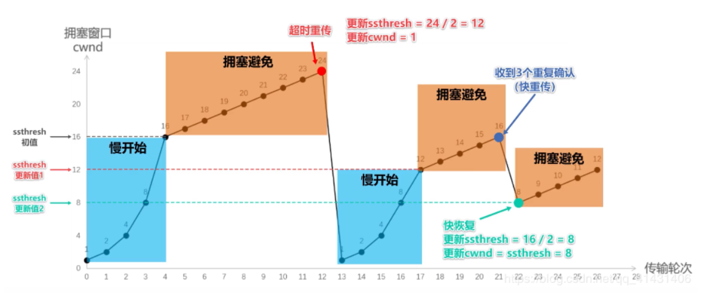

- **如果已经建立了连接，但是客户端突然出现故障了怎么办**

     TCP还设有一个保活计时器，显然，客户端如果出现故障，服务器不能一直等下去，白白浪费资源。服务器每收到一次客户端的请求后都会重新复位这个计时器，时间通常是设置为2小时，若两小时还没有收到客户端的任何数据，服务器就会发送一个探测报文段，以后每隔75秒钟发送一次。若一连发送10个探测报文仍然没反应，服务器就认为客户端出了故障，接着就关闭连接。

- **TCP如何保持数据传输的可靠性**  [详解](https://www.iteye.com/blog/uule-2429131)

1. **校验和：**发送的数据包的二进制相加然后取反，目的是检测数据在传输过程中的任何变化。如果收到段的检验和有差错，TCP将丢弃这个报文段和不确认收到此报文段。 

2. **确认应答+序列号：** TCP给发送的每一个包进行编号，接收方对数据包进行排序，把有序数据传送给应用层。 

3. **超时重传：**当TCP发出一个段后，它启动一个定时器，等待目的端确认收到这个报文段。如果不能及时收到一个确认，将重发这个报文段。 

4. **流量控制：**TCP连接的每一方都有固定大小的缓冲空间，TCP的接收端只允许发送端发送接收端缓冲区能接纳的数据。当接收方来不及处理发送方的数据，能提示发送方降低发送的速率，防止包丢失。TCP使用的流量控制协议是可变大小的滑动窗口协议。 接收方有即时窗口（滑动窗口），随ACK报文发送。

5. **拥塞控制：**当网络拥塞时，减少数据的发送。

​         发送方有拥塞窗口，发送数据前比对接收方发过来的即使窗口，取小

​         慢启动、慢启动门限、拥塞避免、快重传、快恢复

- **TCP粘包拆包如何发生的，怎么解决**
     - 应用程序写入的数据大于套接字缓冲区大小，这将会发生拆包。
       
     - 应用程序写入数据小于套接字缓冲区大小，网卡将应用多次写入的数据发送到网络上，这将会发生粘包。

     - 进行mss（最大报文长度）大小的TCP分段，当TCP报文长度-TCP头部长度>mss的时候将发生拆包。

     - 接收方法不及时读取套接字缓冲区数据，这将发生粘包。

          **解决**
     - 使用带消息头的协议、消息头存储消息开始标识及消息长度信息，服务端获取消息头的时候解析出消息长度，然后向后读取该长度的内容。

     - 设置定长消息，服务端每次读取既定长度的内容作为一条完整消息。

     - 可以在数据包之间设置边界，如添加特殊符号，这样，接收端通过这个边界就可以将不同的数据包拆分开。

### TCP/UDP综合问答

**TCP与UDP的区别**

| TCP面向**有链接**的通信服务 | UDP面向**无连接**的通信服务 |
| --------------------------- | --------------------------- |
| TCP提供可靠的通信传输       | UDP不可靠,会丢包            |
| TCP保证数据顺序             | UDP不保证                   |
| TCP数据无边界               | UDP有边界                   |
| TCP速度慢                   | UDP速度快                   |
| TCP面向字节流               | UDP面向报文                 |
| TCP一对一                   | UDP可以一对一，一对多       |
| TCP报头至少20字节           | UDP报头8字节                |
| TCP有流量控制，拥塞控制     | UDP没有                     |

**为什么UDP比TCP快**

------

1. TCP需要三次握手
2. TCP有拥塞控制，控制流量等机制

**为什么TCP比UDP可靠**

------

1. TCP是面向有连接的，建立连接之后才发送数据；而UDP则不管对方存不存在都会发送数据。
2. TCP有确认机制，接收端每收到一个正确包都会回应给发送端。超时或者数据包不完整的话发送端会重传。UDP没有。因此可能丢包。

**什么时候使用TCP**

------

   	 当对网络通讯质量有要求的时候，比如：整个数据要准确无误的传递给对方，这往往用于一些要求可靠的应用，比如HTTP、HTTPS、FTP等传输文件的协议，POP、SMTP等邮件传输的协议。 在日常生活中，常见使用TCP协议的应用如下： 浏览器，用的HTTP FlashFXP，用的FTP Outlook，用的POP、SMTP Putty，用的Telnet、SSH QQ文件传输

**什么时候应该使用UDP：**

------

   	当对网络通讯质量要求不高的时候，要求网络通讯速度能尽量的快，这时就可以使用UDP。 比如，日常生活中，常见使用UDP协议的应用如下： QQ语音 QQ视频 TFTP

**TCP无边界，UDP有边界**

------

**TCP无边界：**客户端分多次发送数据给服务器，若服务器的缓冲区够大，那么服务器端会在客户端发送完之后一次性接收过来，所以是无边界的；

**UDP有边界：**客户端每发送一次，服务器端就会接收一次，也就是说发送多少次就会接收多少次，因此是有边界的。

------

### 输入URL后发生了什么

**1.在浏览器中输入url** 

​        用户输入url，例如http://www.baidu.com/ 。其中http为协议，http://www.baidu.com 为网络地址，及指出需要的资源在那台计算机上。⼀般网络地址可以为域名或IP地址，此处为域名。使用域名是为了方便记忆，但是为了让计算机理解这个地址还需要把它解析为IP地址。

**2.应用层DNS解析域名**

​        客户端先检查本地是否有对应的IP地址，若找到则返回响应的IP地址。若没找到则请求上级DNS服务器，直至找到或到根节点。检查的顺序一般为 

**浏览器缓存  -->  操作系统缓存  -->  路由器缓存  -->  IPS（互联网服务提供商）服务器的DNS缓存  -->  继续递归根服务器**

​        一般来说在IPS服务器的缓存都能找到，找不到只能继续递归

**3.本机（客户端）与服务器进行TCP连接**

找到对应的IP地址后，本机就尝试与该IP地址建立连接（三次握手）

**4.应用层客户端发送HTTP请求**

​		HTTP请求包括请求报头和请求主体两个部分，其中请求报头包含了至关重要的信息，包括请求的方法（GET /POST）、目标url、遵循的协议（http / https / ftp…），返回的信息是否需要缓存，以及客户端是否发送cookie等。

**5.传输层TCP传输报文**

​		位于传输层的TCP协议为传输报文提供可靠的字节流服务。它为了方便传输，将大块的数据分割成以报文段为单位的数据包进行管理，并为它们编号，方便服务器接收时能准确地还原报文信息。TCP协议通过“三次握⼿”等方法保证传输的安全可靠。
​		“三次握⼿”的过程是，发送端先发送⼀个带有SYN（synchronize）标志的数据包给接收端，在⼀定的延迟时间内等待接收的回复。接收端收到数据包后，传回⼀个带有SYN/ACK标志的数据包以示传达确认信息。接收方收到后再发送⼀个带有ACK标志的数据包给接收端以示握手成功。在这个过程中，如果发送端在规定延迟时间内没有收到回复则默认接收方没有收到请求，而再次发送，直到收到回复为止。

**6.网络层IP协议查询MAC地址**

​		IP协议的作用是把TCP分割好的各种数据包传送给接收方。而要保证确实能传到接收方还需要接收方的MAC地址，也就是物理地址。IP地址和MAC地址是⼀⼀对应的关系，⼀个网络设备的IP地址可以更换，但是MAC地址⼀般是固定不变的。ARP协议可以将IP地址解析成对应的MAC地址。当通信的双方不在同⼀个局域网时，需要多次中转才能到达最终的目标，在中转的过程中需要通过下⼀个中转站的MAC地址来搜索下⼀个中转目标。

**7.数据到达数据链路层**		

​		在找到对方的MAC地址后，就将数据发送到数据链路层传输。这时，客户端发送请求的阶段结束。

**8.服务器接收数据**

​		接收端的服务器在链路层接收到数据包，再层层向上直到应用层。这过程中包括在运输层通过TCP协议将分段的数据包重新组成原来的HTTP请求报文。

**9.服务器响应请求**

​		服务接收到客户端发送的HTTP请求后，查找客户端请求的资源，并返回响应报文，响应报文中包括⼀个重要的信息——状态码。状态码由三位数字组成，其中比较常见的是200 OK表示请求成功。301表示永久重定向，即请求的资源已经永久转移到新的位置。在返回301状态码的同时，响应报文也会附带重定向的url，客户端接收到后将http请求的url做相应的改变再重新发送。404 not found 表示客户端请求的资源找不到。

**10.服务器返回相应文件**
		请求成功后，服务器会返回相应的HTML文件。接下来就到了页面的渲染阶段了，渲染完成后页面就展示在了用户的面前。

------

## 计算机操作系统

### 进程

#### 进程间的通信方式

1. 管道(pipe)
5. 信号量
3. 消息队列
4. 信号
5. 共享内存
6. 套接字

- **管道**
    **a.匿名管道通信**

    匿名管道：管道是⼀种半双工的通信方式，数据只能单向流动，而且只能在具有父子关系的进程间使用。

```c++
//需要的头⽂件
# include  <unisted.h>
//通过pipe()函数来创建匿名管道，fd[0]指向管道的读端，fd[1]指向管道的写端
int pipe(int fd[2]);
```

**b.通过匿名管道实现进程通信的步骤：**

- 父进程创建管道，得到两个文件描述符指向管道的两端
- 父进程fork出子进程，子进程也有两个文件描述符指向同⼀管道
- 父进程关闭fd[0]，子进程关闭fd[1]，即父进程关闭管道的读端，子进程关闭管道的写端。父进程可以往管道中写，子进程可以从管道里读。管道使用环形队列实现的，数据从写端流入从读端流出

> 管道的实质是⼀个内核缓冲区，进程以先进先出的方式从缓冲区存取数据，管道⼀段的进程顺序的将数据写⼊缓冲区，另⼀端的进程则顺序的读出数据。
>
> 该缓冲区可以看做是⼀个循环队列，读和写的位置都是自动增长的，不能随意改变，⼀个数据只能被读⼀次，读出来以后在缓冲区就不复存在了。
>
> 当缓冲区读空或者写满时，有⼀定的规则控制相应的读进程或者写进程进入等待队列，当空的缓冲区有新数据写入或者满的缓冲区有数据读出来时，就唤醒等待队列中的进程继续读写。

**c.有名管道通信**

​		有名管道不同于匿名管道之处在于它提供了⼀个路径名与之关联，以有名管道的⽂件形式存在与⽂件系统中，这样，即使与有名管道的创建进程不存在父子关系的进程，只要可以访问该路径，就能够彼此通过有名管道相互通信。因此，通过有名管道，不相关的进程也能交换数据。

- **信号量**

​        信号量是⼀个计数器，可以用来控制多个进程对共享资源的访问。它常作为⼀种锁机制，防止某进程正在访问共享资源时，其他进程也访问该资源。因此，主要作为进程间以及同⼀进程内不同线程之间的同步⼿段。

为了获得共享资源，进程需要执行下列操作：

1)创建⼀个信号量：这要求调用者指定初始值，对于⼆值信号量来说，它通常是1，也可以是0

2)等待⼀个信号量：该操作会测试⼀个信号量的值，如果小于0，就阻塞。也称为P操作。

3)挂出⼀个信号量：该操作将信号量的值加1，也称为V操作。

- **消息队列**
    - 消息队列是由消息的链表，存放在内核中并由消息队列标识符标识。消息队列克服了信号传递信息少，管道只能承载无格式字节流以及缓冲区大小受限等缺点。
    - 消息队列是消息的链表，具有特定的格式。允许⼀个或多个进程向它写入与读取消息。
    - 消息队列可以实现消息的随机查询，消息不⼀定要以先进先出的次序读取，也可以按消息的类型读取，比FIFO更有优势。

- **信号**
    - 信号是用于进程间相互通信或者操作的⼀种机制，信号可以在任何时候发给某⼀进程，而无需知道该进程的状态。
    - 如果该进程当前未处于执行状态，则该信号就有内核保存起来，直到该进程回复执⾏并传递给它为⽌。
    - 如果⼀个信号被进程设置为阻塞，则该信号的传递被延迟，直到其阻塞被取消时才被传递给进程。

> **Linux系统中常用信号：** **SIGHUP：**用户从终端注销，所有已启动进程都将收到该进程。系统缺省状态下对该信号的处理是终⽌进程。 **SIGINT：**程序终⽌信号。程序运⾏过程中，按 `Ctrl+C` 键将产⽣该信号。**SIGQUIT：**程序退出信号。程序运⾏过程中，按 `Ctrl+\` 键将产生该信号。 **SIGBUS和SIGSEGV**：进程访问⾮法地址。**SIGFPE：**运算中出现致命错误，如除零操作、数据溢出等。 **SIGKILL：**⽤⼾终⽌进程执⾏信号。shell下执⾏ `kill -9` 发送该信号。 **SIGTERM：**结束进程信号。shell下执⾏ `kill` 进程`pid` 发送该信号。**SIGALRM：**定时器信号。 **SIGCLD：**⼦进程退出信号。如果其⽗进程没有忽略该信号也没有处理该信号，则⼦进程退出后将形成僵⼫进程。

- **共享内存**
    - 共享内存就是映射⼀段能被其他进程所访问的内存，这段共享内存由一个进程创建，但多个进程都可以访问。共享内存是最快的通信⽅式，它是针对其他进程间通信方式运行效率低而专门设计的。
    - 使得多个进程可以访问同⼀块内存空间。
    - 为了在多个进程间交换信息，内核专门流出了⼀块内存区，可以由需要访问的进程将其映射到自己的私有地址空间。进程就可以直接读写这⼀块内存而不需要进行数据的拷贝，从而大大提高效率。
- **套接字(socket)**

#### 进程间的同步方式

- **信号量（PV操作）**  [详细](https://www.cnblogs.com/youngforever/p/3250270.html)
- **管程**：所有进程都只能通过管程间接访问临界资源，管程属于共享资源

> 进程同步的实质就是进程的通信，即本质还是通过通信去实现同步，一般来说进程的同步方式肯定是一种通信方式，而一种通信方式一般可以用来实现同步，线程亦然

> **准确说常用的同步方式有信号量、管程还有一些锁（文件锁、互斥锁），不过进程间的通信方式都可以用来实现进程的同步，因此广泛的说进程间的同步方式还有消息队列、共享变量、管道、信号、套接字**

#### 父进程和子进程

##### fork和vfork

​		fork创建子进程，返回两个值。返回0的时候代表这是子进程，⼤于0代表父进程。子进程共享父进程的地址空间以及继承打开的文件描述符。Linux采用的是写时复制技术，只有在父子进程尝试修改地址空间的时候，才会出发缺页中断处理程序进行真正的拷贝。
​		vfork和fork类似，都是采用写时复制技术，不过vfork保证子进程优先运行，直到子进程调用了exec或者exit才轮到父进程运行。
​		fork所复制的内容：fork时子进程获得**父进程的数据空间、堆栈的复制,以及共同的文件描述符**。

##### 子进程从父进程继承

数据空间（代码段、数据段等）、用户堆栈空间、**已打开的**文件描述符、共享内存

##### 父子进程不同

​		独立的地址空间（子进程有写操作时会分配另外的内存空间）、进程号PID、不同的父进程号、自己的文件描述符。

​		子进程不继承父进程的进程正文，数据和其他锁定内存；不继承异步输入和输出。

#### 僵尸进程和孤儿进程

​		**僵尸进程**，是指子进程退出时，父进程并未对其发出的SIGCLD信号进⾏适当处理，导致子进程停留在僵死状态等待父进程对其进行善后处理。
​		设置僵死状态的目的是维护子进程的信息，以便父进程在以后某个时候获取。这些信息包括⼦进程的进程ID、终止状态以及资源利用信息。如果⼀个进程终止，而该进程有子进程处于僵死状态，那么它的所有僵死子进程的父进程ID将被重置为1(init进程)。继承这些子进程的init进程将负责清理他们。
​		**危害：**如果僵⼫进程不进行处理的话，那么保留的进程信息就不会被释放，其进程号就会被⼀直占用，但是系统所能使用的进程号是有限的，如果⼤量的产⽣僵⼫进程，将因为没有可用的进程号而导致系统不能产生新的进程。
​	**孤儿进程**指的是在⼀个有父子关系的进程中，父进程比子进程更早的结束了，此时子进程会被init进程接⼿并进⾏善后。

#### **守护进程**

​		守护进程是在后台运行不受终端控制的进程，⼀般的网络服务都是以守护进程的方式运行。守护进程脱离终端的主要原因有两点：

- **用来启动守护进程的终端在启动守护进程之后，需要执行其他任务**

- **由终端上的⼀些键所产生的信号(如中断信号)，不应对以前从该终端上启动的任何守护进程产生影响**

​        通常来说，守护进程没有任何存在的父进程，且在Unix系统进程层级中直接位于init之下。守护进程程序通常通过如下方法使自己称为守护进程：

- **对⼀个进程运行fork，然后让父进程立刻终止**
- **让子进程被init进程接收，在init下运行**
- **在子进程中使用setsid() 创建新会话。**

​        setsid函数用于创建⼀个新的会话，并担任该会话组的组长。调用setsid有三个作用：**让进程摆脱原会话的控制、让进程摆脱原进程组的控制和让进程摆脱原控制终端的控制。**

​        在调用fork函数时，子进程全盘拷贝父进程的会话期(session，是⼀个或多个进程组的集合)、进程组、控制终端等，虽然父进程退出了，但原先的会话期、进程组、控制终端等并没有改变，因此，那还不是真正意义上使两者独立开来。setsid函数能够使进程完全独立出来，从而脱离所有其他进程的控制。

- **改变工作目录**

- **重设文件常见掩码**

​        文件创建掩码是指屏蔽掉文件创建时的对应位。由于使用fork函数新建的子进程继承了父进程的文件创建掩码，这就给该子进程使用文件带来了诸多的麻烦。因此，把文件创建掩码设置为0，可以大大增强该守护进程的灵活性。设置文件创建掩码的函数是umask，通常的使用方法为umask(0)。

- **关闭文件描述符**

#### 进程调度算法

1. 先来先服务算法
2. 时间片轮转算法
3. 短作业优先算法
4. 最短剩余时间优先
5. 高响应比优先
6. 优先级调度
7. 多级反馈队列调度算法

### 线程

#### 惊群效应

​        ⼀组睡眠线程等待同⼀个资源，当该资源就绪的时候，会同时通知所有线程退出睡眠状态，然后所有线程对该资源进行争抢，最后只有⼀个线程获得该资源，这就是惊群效应。惊群效应往往会造成过多的系统开销。这时的解决方式⼀般是加锁和队列方式。使得资源满足时，只唤醒队列中的第⼀个线程即可。

#### 线程同步的方式

- **临界区**

  通过多线程的串行化来访问公共资源或者⼀段代码，速度快，适合控制数据访问。

- **互斥量**

  采⽤互斥对象机制，只有拥有互斥对象的线程才有访问公共资源的权限，因为互斥对象只有⼀个，所以可以保证公共资源不会被多个线程同时访问

- **信号量**

  为控制具有有限数量的用户资源而设计的，它允许多个线程在同⼀时刻去访问同⼀个资源，但⼀般需要限制同⼀时刻访问此资源的最⼤线程数目。

- **信号（事件）**

  Wait/Notify：通过通知操作的方式来保持多线程同步，还可以方便的实现多线程优先级的比较操作。

#### 线程间的通信方式

1. 是通过**共享变量**，线程之间通过该变量进行协作通信
2. 通过**消息队列**（本质上也是线程间共享同一块内存，该队列向全部线程暴露，需保证线程安全）来实现消费者和生产者的模式来进行通信（服务器项目采用的就是消息队列通信）
3. **临界区**
4. **互斥量**
5. **信号量**
6. **信号（时间）**

#### 条件变量

​		与互斥锁不同，条件变量是用来等待而不是用来上锁的。条件变量用来自动阻塞一个线程，直到某特殊情况发生为止。通常条件变量和互斥锁同时使用。

​		条件变量使我们可以睡眠等待某种条件出现。条件变量是利用线程间共享的全局变量进行同步的一种机制，主要包括两个动作：一个线程等待"条件变量的条件成立"而挂起；另一个线程使 "条件成立"（给出条件成立信号）。

​		条件的检测是在互斥锁的保护下进行的。如果一个条件为假，一个线程自动阻塞，并释放等待 状态改变的互斥锁。如果另一个线程改变了条件，它发信号给关联的条件变量，唤醒一个或多个等待它的线程，重新获得互斥锁，重新评价条件。如果两进程共享可读写的内存，条件变量 可以被用来实现这两进程间的线程同步。

​		例子可举生产者消费者，有机会深入了解：[深入解析条件变量](https://www.cnblogs.com/harlanc/p/8596211.html)

#### 多线程设计模式

- **Reactor模式**

    ​        同步阻塞IO模式，注册对应读写事件处理器，等待事件发生进而调用事件处理器处理事件。具体的说就是：主线程往epoll内核上注册socket读事件，主线程调用epoll_wait等待socket上有数据可读，当socket上有数据可读的时候，主线程把socket可读事件放⼊请求队列。睡眠在请求队列上的某个工作线程被唤醒，处理客户请求，然后往epoll内核上注册socket写请求事件。主线程调⽤epoll_wait等待写请求事件，当有事件可写的时候，主线程把socket可写事件放⼊请求队列。睡眠在请求队列上的某个⼯作线程被唤醒，处理客户请求。

- **Proactor模式**

    ​        异步IO模式，主线程调⽤aio_read 函数向内核注册socket上的读完成事件，并告诉内核⽤⼾读缓冲区的位置，以及读完成后如何通知应⽤程序，主线程继续处理其他逻辑，当socket上的数据被读⼊⽤⼾缓冲区后，通过信号告知应⽤程序数据已经可以使⽤。应⽤程序预先定义好的信号处理函数选择⼀个⼯作线程来处理客⼾请求。⼯作线程处理完客⼾请求之后调⽤aio_write 函数向内核注册socket写完成时间，并告诉内核写缓冲区的位置，以及写完成时如何通知应⽤程序。主线程处理其他逻辑。当⽤⼾缓冲区的数据被写⼊socket之后内核向应⽤程序发送⼀个信号，以通知应⽤程序数据已经发送完毕。应⽤程序预先定义的数据处理函数就会完成⼯作。

- **半同步/半异步模式**
  - 上层的任务(如数据库查询，⽂件传输)使⽤同步IO模型，简化了编写难度
  - 底层的任务(如⽹络控制器的中断处理)使⽤异步IO模型，提供了执⾏效率

#### 协程

​		协程是⼀种用户态的轻量级线程，协程的调度完全由用户控制。协程拥有自己的寄存器上下文和栈。协程调度切换时，将寄存器上下文和栈保存到其他地方，在切换回来的时候，恢复之前保存的寄存器上下文和栈，直接操作栈则基本没有内核切换的开销。可以不加锁访问全局变量，所以上下文的切换非常快。
​		**协程本质上就是单线程，多个协程协作好比就是你一个人其实同时只能做一件事，但是你把几个任务拆成几截来交叉执行。**就是只是中间加了 yield，让它跑了⼀半暂停执行，然后产出结果给调度它（这个协程）的父级上下文，如果父级不再需要执行下去了可以先调用别的函数，等别的 yield 了再 transfer 回去执行这个。 

#### 多线程和多进程的区别

|                | 多进程                                                     | 多线程                         |
| -------------- | ---------------------------------------------------------- | ------------------------------ |
| 数据共享、同步 | 数据是分开的，共享复杂：需要使用IPC，同步简单              | 共享进程数据，同步复杂         |
| 内存、CPU      | 占⽤内存多、CPU利用率低                                    | 占⽤内存少、CPU利⽤率⾼        |
| 创建销毁、切换 | 创建销毁、切换复杂、速度慢                                 | 创建销毁、切换简单，速度快     |
| 编程调试       | 简单                                                       | 复杂                           |
| 可靠性         | 进程间不会互相影响                                         | ⼀个线程挂掉会导致整个进程挂掉 |
| 分布式         | 适用于多核、多机分布；如果⼀台机器不够，扩展到多台比较简单 | 适用于多核分布                 |

#### 线程和进程的区别

​     	**进程和线程的区别主要在于它们是不同的操作系统资源管理方式。进程是资源（CPU、内存等）分配的基本单位，线程是CPU调度和分配的基本单位（程序执行的最小单位）**

1. 进程有独立的地址空间，⼀个进程崩溃后，在保护模式下不会对其他进程产生影响。而线程只是⼀个进程中的不同执行路径，线程有自己的堆栈和局部变量，但线程没有单独的地址空间，⼀个线程挂掉就等于整个进程挂掉，所以多进程的程序要比多线程更健壮。
2. 进程切换过程中的开销较大，效率较低，而多个线程共享内存，可以极大地提高了程序的运行效率，并发性较好
3. 线程的划分尺度小于进程，一个进程可以有多个线程，一个线程只能属于一个进程
4. 每个独立的线程有⼀个程序运行的入口、顺序执行序列和程序的出口。但是线程不能够独立执行，必须依存在应用程序中，由应用程序提供多个线程执行控制
5. 从逻辑角度来看，多线程的意义在于⼀个应用程序中，有多个执行部分可以同时执行。但操作系统并没有将多个线程看做多个独立的应用，来实现进程的调度和管理以及资源分配。

### 锁

#### 原子操作

原子操作是指不会被线程调度机制打断的操作；这种操作⼀旦开始就⼀直运行到运行结束。

实现原理：总线锁和缓存锁定

#### 乐观锁和悲观锁

- **乐观锁**

​        总是假设最好的情况，每次去拿数据的时候都认为别⼈不会修改，所以不会上锁，但是在更新的时候会判断⼀下在此期间别⼈有没有去更新这个数据，可以使用**版本号机制**和**CAS算法**实现。乐观锁适用于多读的应用类型，这样可以提高吞吐量。

**版本号机制：**

​    	⼀般是在数据表中加上⼀个数据版本号version字段，表示数据被修改的次数，当数据被修改的时候，version值会加1。当线程A要更新数据值的时候，在读取数据的同时也会读取version值，在提交更新的时候，若刚才读取到的version值和现在的version值相等时才更新，否则重试更新操作。

**CAS算法：**

​		即compare and swap(比较和交换)，是⼀种有名的无锁算法、无锁编程，即不适用锁的情况实现多线程之间的变量同步。CAS涉及三个操作数：

- 需要读写的内存值V
- 进行比较的A
- 拟写入的新值B

​        当且仅当 V 的值等于 A时，CAS通过原子方式用新值B来更新V的值，否则不会执行任何操作（比较和替换是⼀个原子操作）。⼀般情况下是⼀个自旋操作，即不断的重试。

缺点：1. ABA问题 2. 自旋CAS开销大3. 只能保证⼀个共享变量的原⼦操作

- **悲观锁**

​        总是假设最坏的情况，每次去拿数据的时候都认为别人会修改，所以每次在拿数据的时候都会上锁，这样别⼈想拿这个数据就会阻塞直到它拿到锁（共享资源每次只给⼀个线程适用，使⽤其他线程阻塞，用完后再把资源转让给其他线程）。

#### [死锁](https://blog.csdn.net/wljliujuan/article/details/79614019) 

- **死锁产生的原因**

**1.竞争不可抢占资源引起死锁**

​		通常系统中拥有的不可抢占资源，其数量不足以满足多个进程运行的需要，使得进程在运行过程中，会因争夺资源而陷入僵局，如磁带机、打印机等。只有对不可抢占资源的竞争 才可能产生死锁，对可抢占资源的竞争是不会引起死锁的。

**2.竞争可消耗资源引起死锁**

**3.进程推进顺序不当引起死锁**

​		进程在运行过程中，请求和释放资源的顺序不当，也同样会导致死锁。例如，并发进程 P1、P2分别保持了资源R1、R2，而进程P1申请资源R2，进程P2申请资源R1时，两者都会因为所需资源被占用而阻塞。
信号量使用不当也会造成死锁。进程间彼此相互等待对方发来的消息，结果也会使得这 些进程间无法继续向前推进。例如，进程A等待进程B发的消息，进程B又在等待进程A 发的消息，可以看出进程A和B不是因为竞争同一资源，而是在等待对方的资源导致死锁。

- **产生的必要条件**

1. **互斥条件：**进程要求对所分配的资源（如打印机）进行排他性控制，即在一段时间内某资源仅为一个进程所占有。此时若有其他进程请求该资源，则请求进程只能等待。
2. **请求与保持条件：**进程已经保持了至少一个资源，但又提出了新的资源请求，而该资源已被其他进程占有，此时请求进程被阻塞，但对自己已获得的资源保持不放。
3. **不剥夺条件：**进程已经获得的资源，在使用完之前，不能强行剥夺
4. **循环等待条件：**若干进程之间形成⼀种头尾相接的循环等待资源关系

- **死锁的避免**

1. 进程启动拒绝：如果⼀个进程的请求会导致死锁，则不启动该进程
2. 资源分配拒绝：如果⼀个进程增加的资源请求会导致死锁，则不允许这次分配（银行家算法）

	**银行家算法**

1. 如果request<=need，转向步骤2；否则认为出错，因为请求资源⼤于需要资源。
2. 如果request<=available，转向步骤3,；否则尚⽆⾜够资源，进程p阻塞；
3. 系统尝试为把资源分配给进程P，并修改available、allocation和need的数值。
4. 系统执⾏安全性算法，检查此次分配后系统是否处于安全状态，若安全，才正式将资源分配给进程P，否则将本次试探性分配作废，让进程P等待。

> **安全状态：**系统能按照某种进程顺序，为每个进程分配资源，直⾄满⾜每个进程对资源的最⼤需求，使每个进程都可顺利完成。

- **死锁的预防**

1. 占有且等待：为预防占有且等待条件，可以要求进程⼀次性的请求所需要的资源，并且阻塞这个进程知道所有请求都同时满足
2. 不可抢占：a.如果占有某些资源的⼀个进程进行进一步资源请求时被拒绝，则该进程必须释放它最初占有的资源。b.如果⼀个进程请求当前被另⼀个进程占有的⼀个资源，则该操作系统可以抢占另外⼀个进程，要求它释放资源
3. 循环等待：通过定义资源类型的线性顺序来预防。如果⼀个进程已经分配了R类资源，那么接下来请求的资源只能是那些排在R类型后面的资源类型。

------

### Linux架构

#### 用户态和内核态

⾸先，要说的是Linux的整体架构

```
-----------------------
| 		应⽤程序	    |
-----------------------
| 	 库函数 |  Shell 	 |
--------系统调用---------
| 		  内核    	  |
```

​		可以知道，通过系统调⽤将Linux整个体系分为用户态和内核态。**用户态**就是提供应用程序运行的空间。**内核态：**从本质上来说就是内核，它是⼀种特殊的软件程序，控制计算机的硬件资源，例如协调CPU资源，分配内存资源，并且提供稳定的环境供应用程序运行。为了让应用程序访问到内核管理的资源例如CPU，内存，IO。内核必须提供⼀组通用的访问接口，也就是所谓的系统调用。

- **系统调用**

​        系统调用是操作系统的最小的功能单位。这些系统调用组成了用户态跟内核态交互的基本接口，例如：用户态想要申请⼀块20K大小的动态内存，就需要系统调用，将数据段指针向下偏移。

- **库函数**

​        库函数就是屏蔽这些复杂的底层实现细节，减轻程序员的负担，从而更加关注上层的逻辑实现。它对系统调用进行封装，提供简单的基本接口给用户，这样增强了程序的灵活性，当然对于简单的接口，也可以直接使用系统调用访问资源，例如：open()，write()，read()。

- **如何实现用户态到内核态的切换**

​        往往我们的系统资源是固定的，例如内存2G，CPU固定，磁盘2TB，网络接口固定。所以就需要操作系统对资源进行有效的利用。假设某个应用程序过分的访问这些资源，就会导致整个系统的资源被占用，如果不对这种行为进行限制和区分，就会导致资源访问的冲突。所以，Linux就将权限等级分为了2个等级，分别就是内核态和用户态。

​    	用户态的进程能够访问的资源受到了极大的控制，而运行在内核态的进程不会受到限制。⼀个进程可以运行在用户态也可以运行在内核态，那它们之间肯定存在用户态和内核态切换的过程。举个例子：库函数接口malloc 申请动态内存，malloc的实现内部最终还是会调⽤brk() 或者mmap() 系统调用来分配内存。

​     所以，从用户态到内核态的切换方式，可以通过系统调调用来切换，当然还有其他方式：

1. **系统调用：**其实系统调用本身就是中断，不过软件中断和硬件中断不同
2. **异常：**如果当前进程运行在用户态，如果这个时候发⽣了异常事件，就会出发切换。例如：缺页异常
3. **外设中断：**当外设完成用户的请求时，会向CPU发送中断信号。

- **为什么要分内核态和用户态**

​        为了安全性。在cpu的⼀些指令中，有的指令如果用错，将会导致整个系统崩溃。分了内核态和用户态后，当用户需要操作这些指令的时候，内核为其提供了API，可以通过系统调调用陷⼊内核，让内核去执行这些操作。

#### 零拷贝

​		在服务器中，经常通过 `read()/write()` 来进⾏数据的传输，这其中涉及到多次的内核态到用户态的拷贝，拿`read()` 来说，系统首先会检查内核缓冲区，查看是否最近访问过该文件，如果没有，系统会⾸先将磁盘中的数据拷贝到内核缓冲区中，然后再从内核缓冲区拷贝到用户堆栈的缓冲区中。 `write()` 同理，先从用户缓冲区(用户态)拷贝到内核缓冲区(内核态)，然后再发送到网卡上。

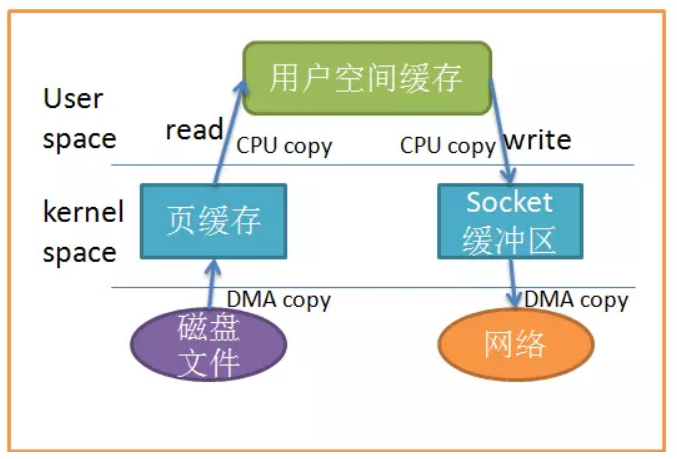

​		**零拷贝技术**指在计算机执行操作时，CPU不需要先将数据从⼀个内存区域复制到另⼀个内存区域，从而可以减少上下文切换以及CPU的拷贝时间。它的作用是在数据报从网络设备到用户程序空间传递的过程中，减少数据拷贝次数，减少系统调用，实现CPU的零参与，彻底消除CPU在这方面的负载。

- 零拷贝机制可以减少数据在内核缓冲区和用户进程缓冲区之间反复的I/O拷贝操作。
- 零拷贝机制可以减少用户进程地址空间和内核地址空间之间因为上下文切换而带来的CPU开销。

在Linux中零拷贝技术主要有3个实现思路：用户态直接进行IO、减少数据拷贝次数以及写时复制技术。

- **用户态直接IO：**应用程序通过使⽤ `mmap()` 可以直接访问硬件存储，操作系统内核只是辅助数据传输。这种方式依旧存在用户空间和内核空间的上下文切换，硬件上的数据直接拷贝到了用户空间，不经过内核空间。因此，直接IO不存在内核空间缓冲区和用户空间缓冲区之间的数据拷贝。

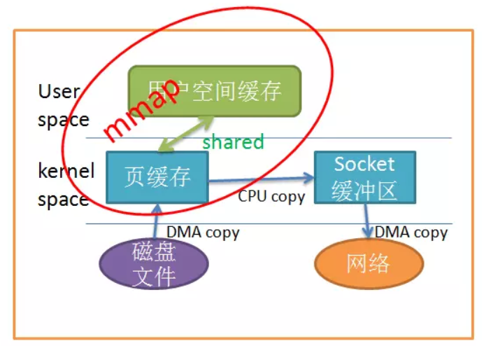

- **减少数据拷贝次数：**在数据传输过程中，避免数据在用户空间缓冲区和系统内核空间缓冲区之间的CPU拷贝，以及数据在系统内核空间内的CPU拷贝，例如使用使用[sendfile和splice](https://www.jianshu.com/p/fad3339e3448)，这也是当前主流零拷贝技术的实现思路。
- **写时复制技术：**如果多个程序同时访问同一块数据，那么每个程序都拥有指向这块数据的指针，在每个程序看来，自己都是独立拥有这块数据的，只有当程序需要对数据内容进行修改时，才会把数据内容拷贝到程序自己的应用空间里去，这时候，数据才成为该程序的私有数据。如果程序不需要对数据进行修改，那么永远都不需要拷贝数据到自己的应用空间里。这样就减少了数据的拷贝。

### Linux内存管理机制

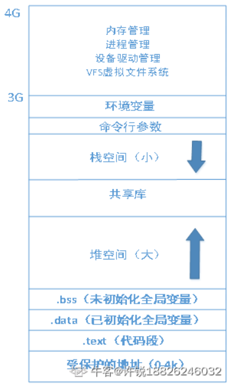

- 用户空间的内存映射采用段页式，而**内核空间有自己的规则**，用户空间需要分配内存的时候，需要内核调配，而所有进程共用同一片内核空间

- Linux采用**段页机制**管理用户空间内存，访问内存的时候先经过分段单元转换成线性地址，然后将分页单元转换成物理地址。此外，使用伙伴关系算法和slab算法管理物理内存。
- Linux内核空间中包含两种虚拟地址：一种是物理和逻辑都连续的物理内存映射虚拟地址；另一种是逻辑连续但非物理连续的vmalloc分配的内存虚拟地址。此外，还有**高端内存**进行其他所有物理内存的访问。内核如何通过映射区或高端内存分配物理内存给进程空间，如何获取其他物理内存等问题暂不深究     [详解](https://blog.csdn.net/hustyangju/article/details/46330259)

- **内存管理三问**
    - 进程空间地址如何管理？**虚拟内存**、**vm_area_strcut结构**
    - 进程地址如何映射到物理内存？**缺页中断**、**缺页置换**
    - 物理内存如何被管理？**伙伴关系算法**、**slab算法**、**Vmalloc方法**

#### 虚拟内存

​         为了防止不同进程同⼀时刻在物理内存中运行而对物理内存的争夺和践踏，采用了虚拟内存。
​     	虚拟内存技术使得不同进程在运行空间中，它所看到的是自己独自占有了当前系统的内存。所有进程共享同⼀物理内存，**每个进程只把自己目前需要的虚拟内存空间映射并存储到物理内存上。**事实上，在每个进程创建加载时，**内核只是为进程“创建”虚拟内存的布局（即只是分配了虚拟内存，让进程感觉自己已经拥有了该部分内存），具体就是初始化进程控制表中内存相关的链表，实际上并不立即就把虚拟内存对应位置的程序数据和代码拷贝到物理内存中，等到运行到对应的程序时，才会通过缺页异常，来拷贝数据。**还有进程运行过程中，要动态分配内存，比如malloc时，也只是分配了虚拟内存，即为这块虚拟内存对应的页表项做相应设置，当进程真正访问到此数据时，才引发缺页异常。
​    	请求分页系统、请求分段系统和请求段页式系统都是针对虚拟内存的，通过请求实现内存与外存的信息置换。

虚拟内存的代价：

1. 虚拟内存的管理需要建立很多的数据结构，这些数据结构要占用额外的内存
2. 虚拟地址到物理地址的转换，增加了指令的执行时间
3. 页面的换入/换出需要磁盘IO，耗时
4. 如果一页中只有页部分数据，会浪费内存

#### 缺页中断

​		在调用malloc() 和mmap() 等分配内存函数时，在分配时只是建立了进程虚拟地址空间，并没有分配虚拟内存对应的物理内存。当进程访问这些没有建立映射关系的虚拟内存时，处理器自动触发⼀个缺页异常。
​		**缺页中断：**在请求分页系统中，可以通过查询页表中的状态位来确定所要访问的页面是否存在于内存中。每当要访问的页面不在内存，会产生⼀次缺页中断，此时操作系统会根据页表中的内存地址在内存中找到所缺的一页，将其调入内存。

当一个进程发生缺页中断时，会执行以下操作：

- 检查要访问的虚拟地址是否合法 
- 查找/分配一个物理页 
- 填充物理页内容（读取磁盘，或者直接置0，或者啥也不干） 
- 建立映射关系（虚拟地址到物理地址） 
- 重新执行发生缺页中断的那条指令 

缺页本身是⼀种中断，需要经过4个处理步骤：

- 保护CPU现场
- 分析中断原因
- 转入缺页中断处理程序进行处理
- 恢复CPU现场，继续执行

但是缺页中断是由于所要访问的页面不存在于内存时，由硬件所产生的⼀种特殊中断，因此，与一般的中断存在差别：

- 在指令执行期间产生和处理缺页中断信号
- 一条指令在执行期间，可能多次产生缺页中断
- 缺页中断返回时，执行产生中断的⼀条指令，而⼀般的中断返回时，执行下一条指令

#### 缺页置换

​		当访问⼀个内存中不存在的页，并且内存已满，则需要从内存中调出⼀个页或将数据送至磁盘对换区，替换⼀个页，这种现象叫做缺页置换。当前操作系统最常采用的缺页置换算法如下：

- **先进先出(FIFO)算法**

​        置换最先调入内存的页面，即置换在内存中驻留时间最久的页面。按照进入内存的先后次序排列成队列，从队尾进入，从队首删除。

- **最近最久未使用（LRU）算法:** 

​        置换最近⼀段时间以来最长时间未访问过的页面。根据程序局部性原理，刚被访问的页面，可能马上又要被访问；而较长时间内没有被访问的页面，可能最近不会被访问。当前最常采用的就是LRU算法。

- **最近最少使用（LFU）算法**

​        如果一个数据在最近一段时间很少被访问到，那么可以认为在将来它被访问的可能性也很小。因此，当空间满时，最小频率访问的数据最先被淘汰。

#### mmap

​		[mmap](https://blog.csdn.net/qq_33611327/article/details/81738195)是一种内存映射文件的方法，即将一个文件或者其它对象映射到进程的地址空间，实现文件磁盘地址和进程虚拟地址空间中一段虚拟地址的一一对映关系。实现这样的映射关系后，进程就可以采用指针的方式读写操作这一段内存，而系统会自动回写脏页面到对应的文件磁盘上，即完成了对文件的操作而不必再调用read,write等系统调用函数。相反，内核空间对这段区域的修改也直接反映用户空间，从而可以实现不同进程间的文件共享。

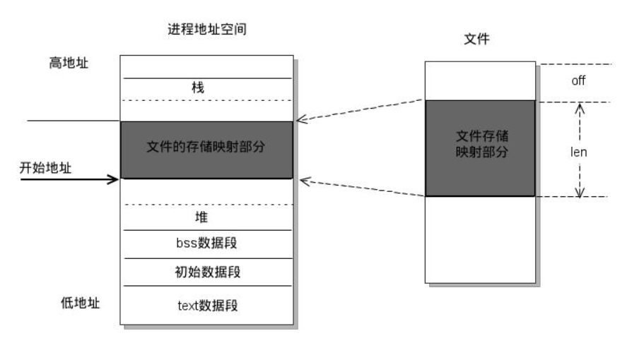

**mmap内存映射原理**

1. 进程启动映射过程，并在虚拟地址空间中为映射创建虚拟映射区域
2. 调用内核空间的系统调用函数mmap（不同于用户空间函数），实现文件物理地址和进程虚拟地址的一一映射关系
3. 进程发起对这片映射空间的访问，引发缺页异常，实现文件内容到物理内存（主存）的拷贝

#### 管理物理内存

##### 伙伴关系算法

- **原理**

​        Linux的伙伴算法把所有的空闲页面分为10个块组，每组中块的大小是2的幂次方个页面，例如，第0组中块的大小都为2^0，第1组中块的大小都为2，第9组中块的大小都为2^9。也就是说，每⼀组中块的大小是相同的，且这同样大小的块形成⼀个链表。

- 通过⼀个简单的例子来说明该算法的工作原理：

​        假设要求分配的块其大小为128个页面（由多个页面组成的块叫做页面块）。该算法现在块大小为128个页面的链表中查找，看是否有这样⼀个空闲块。如果有，就直接分配；如果没有，该算法会查找下⼀个更大的块，具体的说，就是在块大小为256个页面的链表中查找⼀个空闲块。如果存在这样的空闲块，内核就把这256个页面分为2等分，⼀份分配出去，另⼀份插入到块大小为128个页面的链表中。如果在块大小为256个页面的链表中也没有找到空闲页块，就继续寻找。

   	 以上过程的逆过程就是块的释放过程，这也是该算法名字的来由。满足以下条件的两个块称为伙伴：

- 两个块的大小相同
- 两个块的物理地址连续

​        伙伴算法把满足以上条件的两个块合并为⼀个块，该算法是迭代算法，如果合并后的块还可以跟相邻的块进行合并，那么就继续合并。

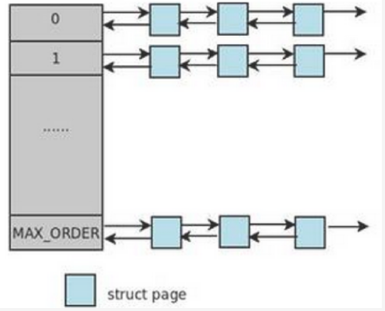

##### slab分配器

​    	slab的出现⼀是为了避免类似于伙伴系统内存分配方法产生大量内部碎片的问题，⼆是作为⼀个高速缓存，可以存储经常分配并释放的对象。

- **slab分配器的基本原理**

​        slab分配器中用到了对象这个概念，所谓**对象就是内核中的数据结构（高速缓存会被数据结构创建并使用）以及对该数据结构进行创建和撤销的操作**。它的基本思想是将内核中经常使用的对象放到高速缓存中，并且由系统保持为初始的可利用状态。比如进程描述符，内核中会频繁对此数据进行申请和释放。当⼀个新进程创建时，内核会直接从slab分配器的高速缓存中获取⼀个已经初始化了的对象；当进程结束时，该结构所占的页框并不被释放，而是重新返回slab分配器中。如果没有基于对象的slab分配器，内核将花费更多的时间去分配、初始化以及释放⼀个对象。

- **slab分配器有以下三个基本目标：**

1. 减少伙伴算法在分配小块连续内存时所产生的内部碎片；
2. 将频繁使用的对象缓存起来，减少分配、初始化和释放对象的时间开销；
3. 通过着色技术调整对象以更好的使用硬件告诉缓存。

- **slab分配器的结构**

​        slab分配器为每种对象分配⼀个高速缓存，这个缓存可以看做是同类型对象的⼀种储备。每个高速缓存所占的内存区又被划分多个slab，每个slab是由⼀个或多个连续的页框组成。每个页框中包含若干个对象，既有已分配的对象，也包含空闲的对象。

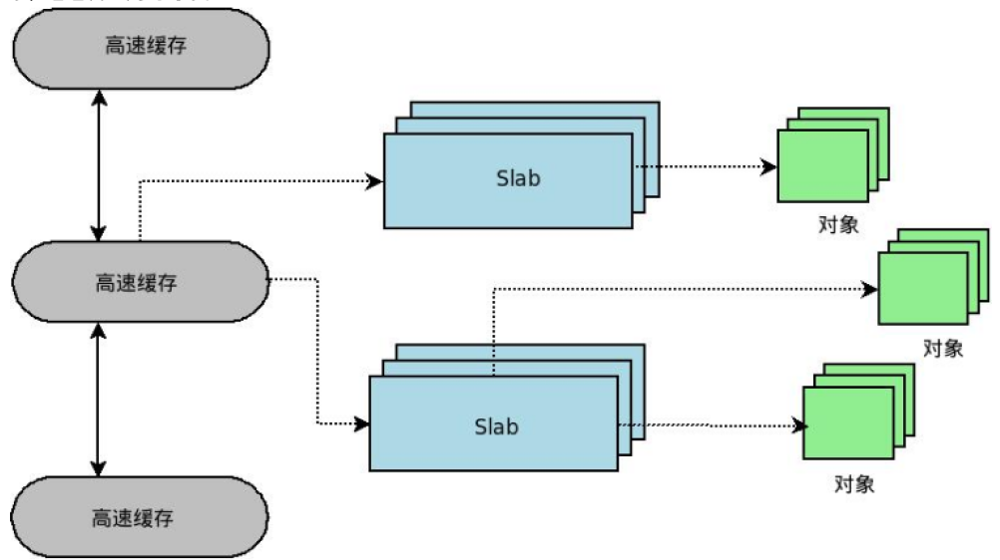

​         每个高速缓存通过kmem_cache 结构来描述，这个结构中包含了对当前高速缓存各种属性信息的描述。所有的高速缓存通过双链表组织在⼀起，形成高速缓存链表cache_chain 。每个kmem_cache 结构中并不包含对具体slab的描述，而是通过kmem_list 结构来组织各个slab。slab描述符中的list字符表明了当前slab处于三个slab链表中的其中⼀个。

### 缓存

​		缓存（cache），原始意义是指访问速度比一般随机存取存储器（RAM）快的一种高速存储器，通常它不像系统主存那样使用DRAM技术，而使用昂贵但较快速的SRAM技术。缓存的设置是所有现代计算机系统发挥高性能的重要因素之一。

​        缓存工作的原则，就是“引用的局部性”，这可以分为时间局部性和空间局部性。空间局部性是指CPU在某一时刻需要某个数据，那么很可能下一步就需要其附近的数据；时间局部性是指当某个数据被访问过一次之后，过不了多久时间就会被再一次访问。对于应用程序而言，不管是指令流还是数据流都会出现引用的局部性现象。

​		**核心思想：把最常用的和附近的一些数据缓存在一个高速存储区里，可根据时间局部性和空间局部性原则，使得读取速度和写入速度尽可能提高。**

#### CPU缓存工作原理

​        CPU要读取一个数据时，首先从Cache中查找，如果找到就立即读取并送给CPU处理；如果没有找到，就用相对慢的速度从内存中读取并送给CPU处理，同时把这个数据所在的数据块调入Cache中，可以使得以后对整块数据的读取都从Cache中进行，不必再调用内存。
​        正是这样的读取机制使CPU读取Cache的命中率非常高（大多数CPU可达90%左右），也就是说CPU下一次要读取的数据90%都在Cache中，只有大约10%需要从内存读取。这大大节省了CPU直接读取内存的时间，也使CPU读取数据时基本无需等待。总的来说，CPU读取数据的顺序是先Cache后内存。

#### 缓存策略

- **基于访问的时间：**此类算法按各缓存项被访问时间来组织缓存队列，决定替换对象。如 LRU
- **基于访问频率：**此类算法用缓存项的被访问频率来组织缓存。如 LFU、LRU2、2Q、LIRS
- **访问时间与频率兼顾：**通过兼顾访问时间和频率。使得数据模式在变化时缓存策略仍有较好性能。如 FBR、LRUF、ALRFU。多数此类算法具有一个可调或自适应参数，通过该参数的调节使缓存策略在基于访问时间与频率间取得一个平衡
- **基于访问模式：**某些应用有较明确的数据访问特点，进而产生与其相适应的缓存策略。如专用的 VoD 系统设计的A&L缓存策略，同时适应随机、顺序两种访问模式的 SARC策略

#### 不同场景下的缓存

- CPU缓存 ——> 加快CPU的处理速度
- 操作系统磁盘缓存 ——> 减少磁盘机械操作。
- 数据库缓存——>减少文件系统IO。
- 应用程序缓存——>减少对数据库的查询。
-  Web服务器缓存——>减少应用服务器请求。
- 客户端浏览器缓存——>减少对网站的访问。

TODO：先进行数据库与redis的学习，再详细了解数据库缓存一致性的问题。

### [阻塞、同步](https://www.jianshu.com/p/3d603166f54d)

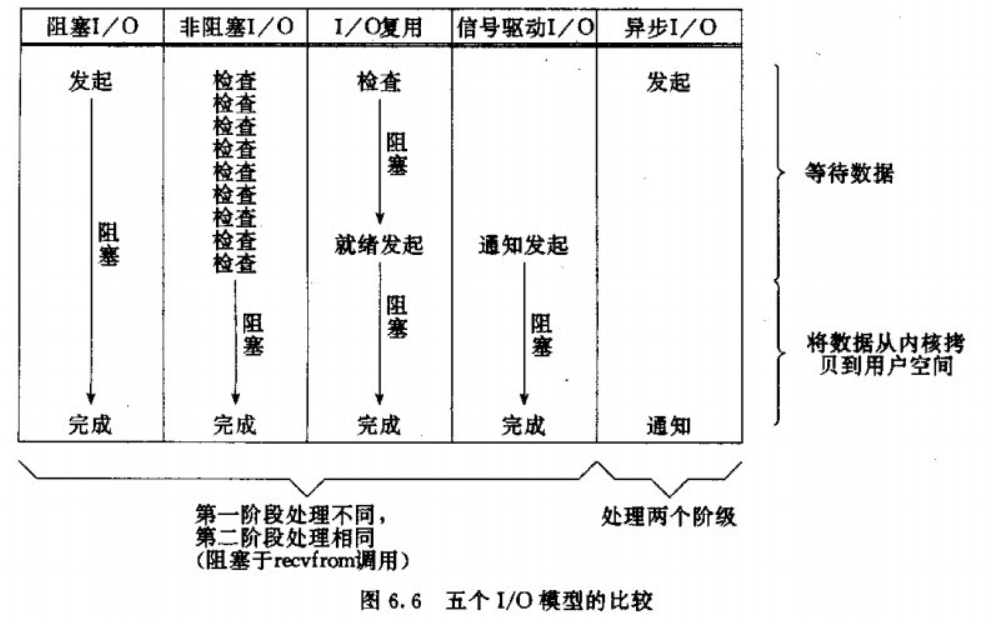

#### IO操作

IO分两阶段（一旦拿到数据后就变成了数据操作，不再是IO）：

1. 数据准备阶段

2. 内核空间复制数据到用户进程缓冲区（用户空间）阶段

#### 阻塞和非阻塞

阻塞和非阻塞关注的是**程序在等待调用结果时的状态**。

- **阻塞与非阻塞**
  - 阻塞与非阻塞一般运用于线程内，反应该线程进行IO读取或其他操作时是否需要等待操作完成
  - 阻塞调用会⼀直等待远程数据就绪在返回，直到读取结束
- 非阻塞无论在什么情况下都会立即返回，虽然非阻塞大部分时间不会被阻塞，但是**它仍要求进程不断的去主动询问内核是否准备好数据**，也需要进程主动再次调用来将数据拷贝到用户内存，并且数据拷贝时进程阻塞（即IO操作第二阶段阻塞，第一阶段不阻塞）
  

#### 同步和异步

同步与非同步关注的是两个程序运行的步调是否需要一致。

- **同步与异步**
  - 同步与异步一般运用于线程间，反应两个线程之间是否有先后关系
  - 会导致进程阻塞的，即同步操作（包括阻塞IO、非阻塞IO、IO复用(select/poll/epoll)、信号驱动IO）
  - 异步不会阻塞调用者的进程，即使是从内核空间的缓冲区将数据拷贝到进程中这一操作也不会阻塞。

### 输入ls发生了什么

​		终端阻塞等待外部输入，请求内核给该进程一个输入；当我们键入ls的时候，键盘驱动产生硬中断，然后经过进程的调度内核把cpu片分配给键盘io设备进程，读取输入流到内核缓冲区，接着把该输入传输到linux的shell读取进程，然后显示出来，按下回车后，该进程进行命令的解析，调用对应该命令的程序，该程序根据输入，再做进一步的输出工作。

## 常用框架

### log4cplus

​		[log4cplus](https://blog.csdn.net/u014695839/article/details/84937769)是一种易于使用的C ++ 日志记录[API](https://log4cplus.sourceforge.io/docs/html/index.html)，可提供线程安全，灵活且任意粒度的日志管理和配置控制。

#### 基本的类

| 类       | 功能                                                         |
| -------- | ------------------------------------------------------------ |
| Logger   | 记录日志的句柄。                                             |
| Appender | 用于指定内容输出位置（如：控制台，文件、远程服务器等）。一个Logger可添加多个Appender，从而向多个位置输出日志。 |
| Layout   | 用于指定日志输出的格式。每个Appender需要设置一个Layout。     |

#### 支持的Appender的类型

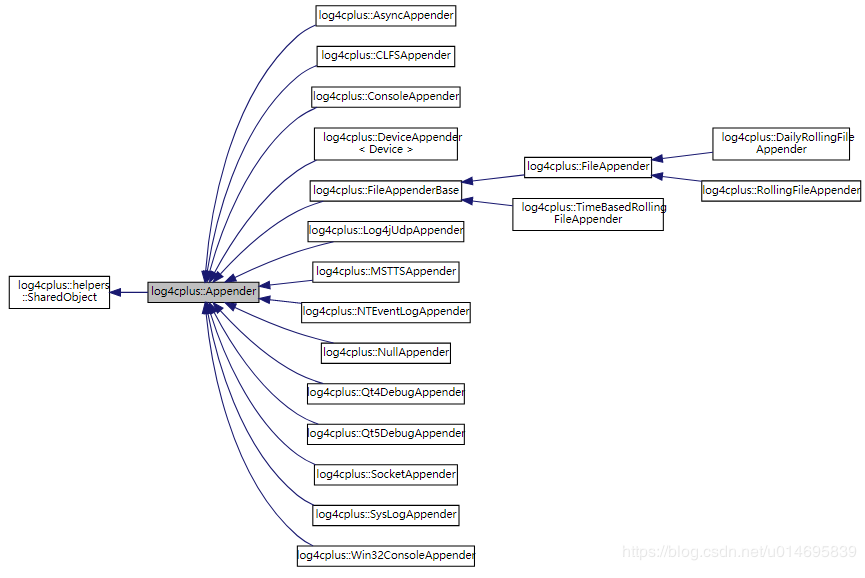

#### 支持的Layout的类型

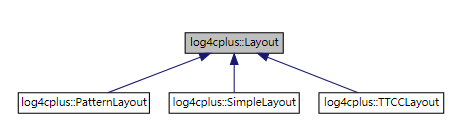

​        上图是Layout的继承关系，其中Log4cplus::Layout是各种Layout的父类。从图中，我们可以得知Layout的类型有3种，分别为PatternLayout、SimpleLayout和TTCCLayout。其中的PatternLayout可以让用户自定义输出格式。

#### 基本使用步骤

1. 创建Appender对象。
2. 设置Appender的名称和输出格式（Layout）
3. 获得一个Logger实例，并设置其日志输出等级阈值
4. 给Logger实例添加Appender
5. 使用宏输出日志（宏的等级有6个，分别为：FATAL, ERROR, WARN, INFO, DEBUG, TRACE。FATAL宏的名为LOG4CPLUS_FATAL( )，ERROR的宏的名为LOG4CPLUS_ERROR( )，以此类推。）


## Linux命令

### 文件操作

返回上一级目录： cd ..

进入某个目录： cd path

在任意目录访问绝对路径：cd /path1/path2

复制整个文件夹： cp -r path1 path2

删除整个文件夹且不递归： rm -rf  path

移动文件：mv file path

### 网络相关

查看ip地址：ifconfig

#### 防火墙/centos7

开启端口8080

firewall-cmd --zone=public --add-port=8080/tcp --permanent

查询端口号8080 是否开启：

firewall-cmd --query-port=8080/tcp

重启防火墙：

firewall-cmd --reload

查询有哪些端口是开启的:

firewall-cmd --list-port

### 其他

从网上下载连接：

### tar压缩命令

#### 命令格式

tar [ 必要参数 ] [ 选择参数 ] [ 文件 ] 

#### 命令功能

用来压缩和解压文件。tar本身不具有压缩功能。他是调用压缩功能实现的 

#### 命令参数

**必要参数有如下：**

-A 新增压缩文件到已存在的压缩

-B 设置区块大小

-c 建立新的压缩文件

-d 记录文件的差别

-r 添加文件到已经压缩的文件

-u 添加改变了和现有的文件到已经存在的压缩文件

-x 从压缩的文件中提取文件

-t 显示压缩文件的内容

-z 支持gzip解压文件

-j 支持bzip2解压文件

-Z 支持compress解压文件

-v 显示操作过程

-l 文件系统边界设置

-k 保留原有文件不覆盖

-m 保留文件不被覆盖

-W 确认压缩文件的正确性


**可选参数如下：**

-b 设置区块数目

-C 切换到指定目录

-f 指定压缩文件

--help 显示帮助信息

--version 显示版本信息

## 多线程服务器项目

### Epoll

- **IO复用：**内核一旦发现进程指定的一个或多个I/O条件就绪，即输入已经准备好被读取，它就通知进程。这个行为称之为I/O复用。
- epoll是IO复用的一种模型（方式）

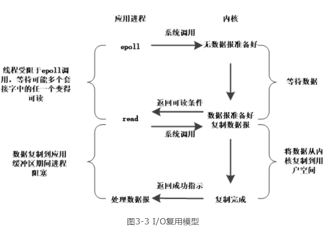

- 如图3-3所示，我们将多个连接套接字注册在I/O复用的epoll系统调用中，并注册读事件，此时系统阻塞于epoll调用，等待某个数据报套接字变为可读。当epoll返回时，将会返回可读的套接字集合，我们只需遍历这些可读套接字，然后分别对每个可读套接字调用read系统调用，读出具体数据，并进一步进行相应处理即可。
- 通过使用epoll的这种I/O复用模型，我们能够在不引入创建新线程开销的前提下实现了服务器对多个连接套接字的读取支持。

### Reactor模式

- reactor模式是一种事件处理的方式
- 我们可以将整个问题抽象。每个已经连接的套接字描述符就是一个事件源，每一个套接字接收到数据后的进一步处理操作作为一个事件处理器。我们将需要被处理的事件处理源及其事件处理器注册到一个类似于epoll的事件分离器中。事件分离器负责等待事件发生。一旦某个事件发送，事件分离器就将该事件传递给该事件注册的对应的处理器，最后由处理器负责完成实际的读写工作。这种方式就是Reactor模式的事件处理方式。
- Reactor模式是一种以事件驱动为核心的机制。在Reactor模式中，应用程序不是主动的调用某个API完成处理，而是逆置了事件处理流程，应用程序需要提供相应的事件接口并注册到Reactor上，如果相应的事件发生，Reactor将主动调用应用程序注册的接口，通过注册的接口完成具体的事件处理。
- Reactor模式由**事件源**、**事件反应器**、**事件分离器**、**事件处理器**等组件组成
- reactor的事件分离中可采用的一种模式可以是epoll

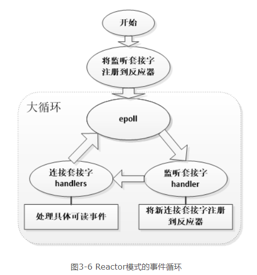

### proactor模式

1. **应用程序**启动，调用**异步操作处理器**提供的异步操作接口函数，调用之后应用程序和异步操作处理就独立运行；应用程序可以调用新的异步操作，而其它操作可以并发进行；
2. 应用程序启动**Proactor主动器**，进行无限的事件循环，等待完成事件到来；
3. 异步操作处理器执行异步操作，完成后将结果放入到完成事件队列；
4. 主动器从完成事件队列中取出结果，分发到相应的完成事件回调函数处理逻辑中；

### reactor和proactor区别

- 主动和被动：

以主动写为例：
        Reactor将handle放到select()，等待可写就绪，然后调用write()写入数据；写完处理后续逻辑；
        Proactor调用aoi_write后立刻返回，由内核负责写操作，写完后调用相应的回调函数处理后续逻辑；

​        可以看出，Reactor被动的等待指示事件的到来并做出反应；它有一个等待的过程，做什么都要先放入到监听事件集合中等待handler可用时再进行操作；
Proactor直接调用异步读写操作，调用完后立刻返回；

- 实现：

Reactor实现了一个被动的事件分离和分发模型，服务等待请求事件的到来，再通过不受间断的同步处理事件，从而做出反应；

Proactor实现了一个主动的事件分离和分发模型；这种设计允许多个任务并发的执行，从而提高吞吐量；并可执行耗时长的任务（各个任务间互不影响）

- 优点：

Reactor实现相对简单，对于耗时短的处理场景处理高效；
操作系统可以在多个事件源上等待，并且避免了多线程编程相关的性能开销和编程复杂性；
事件的串行化对应用是透明的，可以顺序的同步执行而不需要加锁；
事务分离：将与应用无关的多路分解和分配机制和与应用相关的回调函数分离开来，

Proactor性能更高，能够处理耗时长的并发场景；

- 缺点：

Reactor处理耗时长的操作会造成事件分发的阻塞，影响到后续事件的处理；

Proactor实现逻辑复杂；依赖操作系统对异步的支持，目前实现了纯异步操作的操作系统少，实现优秀的如windows IOCP，但由于其windows系统用于服务器的局限性，目前应用范围较小；而Unix/Linux系统对纯异步的支持有限，应用事件驱动的主流还是通过select/epoll来实现；

- 适用场景

Reactor：同时接收多个服务请求，并且依次同步的处理它们的事件驱动程序；
Proactor：异步接收和同时处理多个服务请求的事件驱动程序；

### 半异步和半同步模式

**并发模式中：**“同步”指的是程序完全按照代码序列的顺序执行；“异步”指的是程序的执行需要由系统事件来驱动。常见的系统事件包括中断、信号等。（注意与IO中的同步异步不一样）

**模式运转方式：**半同步/半异步模式中，同步线程用于处理客户逻辑，即逻辑单元；异步线程用于处理I/O事件，即I/O处理单元。

半同步/半反应堆模式：

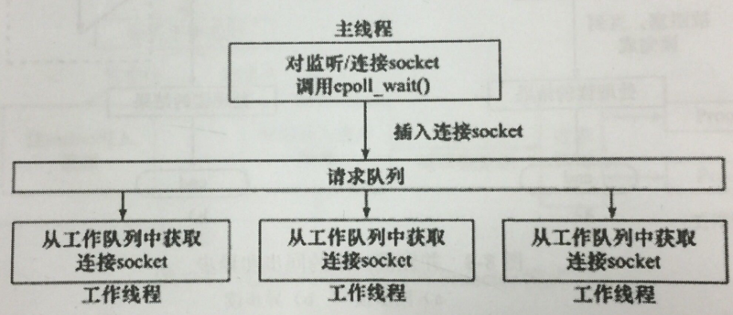

半同步/半异步模式：（即本服务器采用的模式）

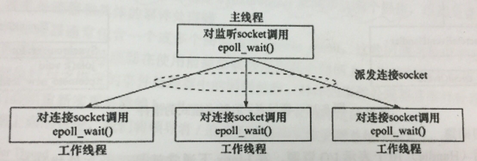


### 静态页面与动态页面

[web静态页面与动态页面的区别](https://blog.csdn.net/LS7011846/article/details/82347746)

### 问答

- **介绍一下项目**

​		我的项目是C++编写的多线程网络服务器框架，这个服务器的框架主要是采用“**一个线程一个循环**”模式，就是创建多个线程，并且每个线程都创建Reactor反应器，每个反应器又存在一个事件循环，用于等待注册事件和处理事件的读写。服务器一般是开启一个主线程和四个IO线程，主线程接收到新的连接之后，通过轮询的方法选择一个IO线程去处理这个新连接，选择了相应的线程之后，就注册相关的读写事件，然后接下来这个连接的读写都会在该线程完成。Reactor反应器的IO复用采用的是epoll，除此之外还基于时间轮实现了定时器功能，定时剔除不活跃连接。在应用层实现了简单的HTTP服务器和一个回显服务器，其中HTTP服务器实现了HTTP报文的解析和Get方法请求，目前的话是只支持静态资源访问，还有支持HTTP长连接。

- **为什么使用epoll不使用poll或select**
  - 相对于select等I/O复用方式，它具有支持大数目的描述符；select最大是2048个（监听端口个数），数组实现；poll没有限制，链表实现
  - I/O效率不随注册的描述符数目增加而线性下降，因为select和poll每次调用时都会对连接进行线性遍历，所以随着FD的增加会造成遍历速度慢的“线性下降性能问题”，因为epoll内核中实现是根据每个fd上的callback函数来实现的，只有活跃的socket才会主动调用callback，所以在活跃socket较少的情况下，使用epoll没有前面两者的线性下降的性能问题，但是所有socket都很活跃的情况下，可能会有性能问题。
  - poll和select内核需要将消息传递到用户空间，都需要内核拷贝动作；利用mmap()文件映射内存加速与内核空间的消息传递，即epoll使用mmap减少复制开销。
  -  [详解2：详细说明](https://blog.csdn.net/wteruiycbqqvwt/article/details/90299610)
- **epoll使用哪种触发，为什么？**

​        使用边缘触发，因为高并发中需要更快地读写，水平触发会一直通知你未读的事件，为了避免不必要的通知，因此采用只通知一次的边缘触发，这样效率更高！

**epoll触发相关：**

1.对于监听的sockfd，最好使用水平触发模式，边缘触发模式会导致高并发情况下，有的客户端会连接不上。如果非要使用边缘触发，网上有的方案是用while来循环accept()。

2.对于读写的connfd，水平触发模式下，阻塞和非阻塞效果都一样，不过为了防止特殊情况，还是建议设置非阻塞。

3.对于读写的connfd，边缘触发模式下，必须使用非阻塞IO，并要一次性全部读写完数据。

4.**本项目接收连接采用边缘触发+非阻塞模式，利用while循环保证每一个连接都被读取；读写中仍然采用边缘触发+非阻塞，用string读取缓冲数据，保证一次性读完。**

- **如何保证线程安全**

采用智能指针和互斥锁

- **怎么在多线程中使用智能指针**

智能指针在保证线程安全时主要作用是保证销毁的线程安全

- **项目如何实现高并发**

​        首先就是服务器采用了多线程的方式去处理各个请求，这样可以让每个线程独占一个核去工作，减少了单线程中核与核之间的切换，又避免了单线程中因处理任务而阻塞的情况，提高了CPU的效率和利用率。同时每个线程都采用了epoll这个IO复用机制，这个机制是linux为多连接数而设计的，因此处理多个任务会更快，综合起来我们可以看到各个任务是看起来是同时执行的，从而实现了并发。

- **怎么实现时间轮定时剔除不活跃连接？**

​        首先构造一个时间轮，设置N个槽，然后定义一个Timer类，这个类相当于TCP连接与时间轮的一个接口吧，构造好时间轮之后，每次创建TCP连接的时候都会把连接标识符和相应的延时时间存进Timer类里面，然后把这个Timer放进时间轮对应的槽里面，然后启动时间轮就可以开始运转，延时时间先到达的就会先执行任务，这个执行任务就是剔除连接。如果某一个TCP连接发送数据的话也会重新调整定时器，重新赋予一个延时值，从而会在时间轮里面更后的位置，实现的原理大概就是这样。

- **为什么使用时间轮来实现？**  [时间轮详解](https://www.jianshu.com/p/0f0fec47a0ad)

​        很多其他定时器也是基于一个延时队列来设计的，一般来说都是用最小堆来实现的这个队列，插入或者取出的时间复杂度为O（logN），如果数量少的话已经够快了，可是我这个服务器是针对于高并发实现的，需要更好的算法，因此采用了时间轮的方法，可以在O（1）的速度下插入或取出任务，这样子速度更快。

- **如何解决时间轮第二圈重叠的问题？**

​        每个任务（即每个Timer类）都会有一个自己的值记录自己处于第几圈，在该任务添加到时间轮时，根据延时时间、槽的数量、槽的时间间隔计算处于第几圈，然后在推动时间轮转动的时候判断是否是第一圈，如果不是第一圈的任务先跳过。

- **如何具体分发和处理事件？**

​        服务器主要是分为一个主线程和四个IO线程，首先呢就是主线程接收TCP请求，接收到请求之后会采用轮询调度的方法将这个新的TCP请求分发给其他四个线程，分发给某个线程之后连接就会在那个线程进行一些读写的操作，当然分发的时候会注册相应的回调函数到epoll里，比如说读、写，有读或者写操作的话就可以回调相应的处理函数。

- **线程安全的队列如何实现的？**

​        采用互斥锁，写入队列或者读出队列的时候都加锁，避免了不同的线程访问队列时冲突。

- **多路IO复用技术怎么体现？**

​         多路IO复用就是多个线程处理多个事件（TCP连接），无论是线程唤醒事件、网络IO事件还是读写事件都是注册到epoll里面统一处理，多路IO复用的优势是减少系统开销，不必创建过多的线程，也不必维护这些线程。

- **muduo网络库**

    [muduo网络库总结](https://www.cnblogs.com/ailumiyana/p/10087539.html)

​        其实就是本服务器采用的模式，non-blocking IO + one loop per thread模型，然后将本服务器如何构造，分发处理事件说一下即可。

- 服务器的瓶颈在哪？
    - 用string作为接收缓存，效率不够高（可以改用数组，不过实现相对麻烦一点）
    - epoll_ctl的消耗较高（尽量所有事情做好再进行注册，不轻易进行注销或修改）
    - 少量竞态拖慢速度

## 其他工具和语言

### makefile

​		makefile是一个构建文件，makefile定义了一系列的规则来指定哪些文件需要先编译，哪些文件需要后编译，哪些文件需要重新编译，甚至于进行更复杂的功能操作。即通过编写构建文件可以实现构建自动化，只需要一个make指令就可以完成编译、连接以至最后的执行。一个编译器（注意区分IDE）就是一个构建的工具，构建过程包括根据makefile文件对项目进行编译，连接，以及生成可执行文件。

​		目前了解到的构建工具有**cmake**，gnumake，Visual C++ nmake， QT 的 qmake，接下来重点学习cmake并尝试用cmake构建项目。

**makefile的几个要点：**

1. 如果这个工程没有编译过，那么我们的所有C文件都要编译并被链接。

2. 如果这个工程的某几个C文件被修改，那么我们只编译被修改的C文件，并链接目标程序。

3. 如果这个工程的头文件被改变了，那么我们需要编译引用了这几个头文件的C文件，并链接目标程序。

### cmake

​		cmake是一个工程构建（编译）工具，可以用简单的语句来描述所有平台的构建(编译过程)。cmake,qmake是跨平台的，其他很多都不跨平台，即在不同平台需要的makefile不一样，如gnu make.

**在 linux 平台下使用 CMake 生成 Makefile 并编译的流程如下:**

1. 编写 CmakeLists.txt。
2. 执行命令“cmake PATH”或者“ccmake PATH”生成 Makefile ( PATH 是 CMakeLists.txt 所在的目录 )。
3. 使用 make 命令进行编译。

**最简单的项目构建代码：**

```cmake
1 PROJECT(main)

2 CMAKE_MINIMUM_REQUIRED(VERSION 2.6)

3 AUX_SOURCE_DIRECTORY(. DIR_SRCS)

4 ADD_EXECUTABLE(main ${DIR_SRCS})
```

**更多信息可参考：**[详细make教程](https://blog.csdn.net/zhuiyunzhugang/article/details/88142908)

### gdb调试

**coredump**:

​		通常指对应程序由于各种异常或者bug导致在运行过程中异常退出或者中止，并且在满足一定条件下会产生一个叫做core的文件。

​		通常情况下，core文件会包含了程序**运行时的内存**，**寄存器状态**，**堆栈指针**，**内存管理信息**还有**各种函数调用堆栈信息**等，我们可以理解为是程序工作当前状态存储生成的一个文件，许多的程序出错的时候都会产生一个core文件，通过工具分析这个文件，我们可以定位到程序异常退出的时候对应的堆栈调用等信息，找出问题所在并进行及时解决。

**gdb:**

1. 可以用where或者bt命令查看core文件，不过前提是系统开了core选项
2. 可以根据命令执行断点调试，找出错误的地方
3. 段错误出现原因及解决方法：[详情点击此处](https://www.cnblogs.com/panfeng412/archive/2011/11/06/segmentation-fault-in-linux.html)
4. [gdb详细使用方法](https://www.cnblogs.com/arnoldlu/p/9633254.html)

### valgrind

​         Valgrind是一个提供程序调试及性能分析的工具集。其包含的工具主要有Memcheck，Cachegrind，Callgrind，Massif等。其中，最为常用的是Memcheck，其主要用来检查程序heap上的内存使用情况。

### shell

​        Shell 是一个用 C 语言编写的程序，它是用户使用 Linux 的桥梁。Shell 既是一种命令语言，又是一种程序设计语言。
​        Shell 是指一种应用程序，这个应用程序提供了一个界面，用户通过这个界面访问操作系统内核的服务。

详细可转到：[shell教程](https://www.runoob.com/linux/linux-shell.html)

## MORE

### 自我介绍

**技术：**

​        面试官你好！我叫李国延，目前就读于广东工业大学，读的是计算机学院的计算机科学与技术专业，是一名大三的学生。18年7月的时候加入了学校的QG工作室，在工作室我们的主要工作是开发一些创新性的项目然后参加一些比赛，我负责的部分是嵌入式开发，用的是C语言，对C语言也算是比较熟悉。然后自己不想走比较偏硬的方向，所以半年前开始学习C++并向服务端发展，学习了一些服务端网络编程、多线程编程的知识，同时也具有一定的操作系统和计算机网络的知识，因此想要应聘一下后台的实习生岗位，从而得到更好的锻炼，进一步提升自己。我的自我介绍就到这里，谢谢。

### 关于考研

我目前是不打算考研，每个人有每个人不同的选择嘛，我想早点出来工作锻炼自己，我相信只要我努力，积极积累经验和学习知识，我相信三年之后我不一定会比研究生差！

### 关于品质

#### 自己的优点是什么，举个例子

能吃苦耐劳，会积极上进学习新知识。考核的时候进学校的团队（简单介绍团队），强调几率（16/300），强调多人放弃，自己坚持下来并最终进入团队，然后积极学习团队安排的知识，获得嵌入式组优秀学员。

#### 自己的缺点是什么，举个例子

可能工作或者学习的时候比较投入，忽略了身边同学的感受

### 关于秋招

#### 一些想法计划

​		开发环境和上线流程这个还是点到为止即可，毕竟这些东西是过一遍就会了的，并且每个公司的环境和流程不同，不必过于纠结和深究。再进一步说，工程能力不是用这个来衡量的，而是实际开发中的开发能力、与各方的协调能力、问题的实际处理能力等。目前，就秋招来说，还是以基础为主，会考察实习过程中所负责的任务，但是对工程能力无直接体现，所以还是以复习基础为主，拓展后端知识以及框架，丰富项目经历，做好准备，等待机会的降临。

##### 秋招需要准备的

- 高并发的服务器底层框架
- 基于高并发服务器的多发联动项目的后台
- 计网、操作系统、C++、数据库、Linux命令等基础
- **算法**
- 各种常用C++框架:muduo、libevent、redis、kafka、log4plus
- 实习经历：1）优化了某个小流程（要有前后对比，数据支撑） 2）处理了多个可能发生或已发生的问题（要了解问题处理的流程：如何观察出现问题，出现问题如何观察以及调试，修改完毕如何测试是否已经完成。）